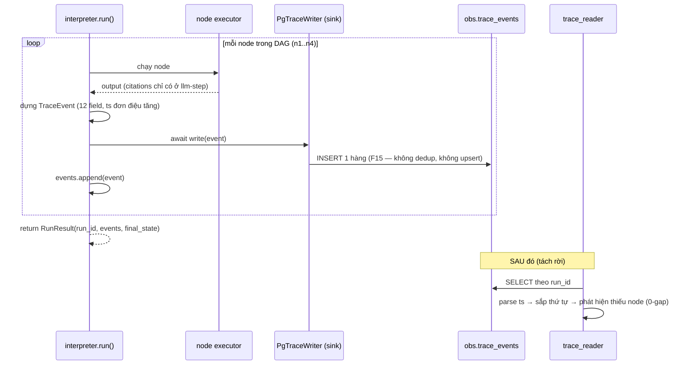

# Trace Sink — luồng `TraceEvent` từ interpreter tới Postgres và đọc lại

> Giải thích dễ hiểu nhất về **trace**: một agent chạy qua nhiều **node**, mỗi node chạy xong đẻ ra
> **1 `TraceEvent`**, event được **ghi (sink) vào bảng `obs.trace_events`** trên Postgres, và sau đó
> **trace reader** (của DE) đọc lại để dựng timeline + phát hiện thiếu node.
>
> Nguồn code (đọc thẳng, không bịa): `studio_contracts/trace.py` (định nghĩa `TraceEvent`) ·
> `studio_engine/interpreter.py` (chỗ **emit**) · `studio_app/obs/schema.py` (bảng
> `obs.trace_events`) · `studio_app/obs/trace_writer.py` (`PgTraceWriter` — cái ghi) ·
> `studio_kb/trace_reader.py` (cái đọc lại).

---

## 1. Bức tranh toàn cảnh (một lần chạy agent)

```
    RECIPE  ─ hợp đồng đầu vào
    ┌──────────────────────────────────────────────┐
    │ dag 4 node:  n1 → n2 → n3 → n4               │
    └───────────────────────┬──────────────────────┘
                            │  run(recipe, tenant_id)
                            ▼

  ① EMIT  ─ repo `engine` (AIE-1) ─ interpreter.run()
    ┌──────────────────────────────────────────────┐
    │ for node in walk(dag):                       │
    │   1. dựng 1 TraceEvent  (12 trường)          │
    │   2. await trace_writer.write(event)         │
    │   3. events.append(event)                    │
    └───────────────────────┬──────────────────────┘
                            │  1 node chạy xong = 1 event
                            ▼

  ② SINK  ─ repo `apps/studio` (mentor) ─ PgTraceWriter
    ┌──────────────────────────────────────────────┐
    │ write(event) = ĐÚNG 1 INSERT trần            │
    │ không dedup · không upsert · không gộp       │
    └───────────────────────┬──────────────────────┘
                            │
                            ▼

      obs.trace_events  ─ Postgres, sổ cái quan sát
    ┌──────────────────────────────────────────────┐
    │ 1 hàng = 1 node đã chạy                      │
    │ 12 cột, event_id là PRIMARY KEY  (xem §6)    │
    └───────────────────────┬──────────────────────┘
                            │  SELECT theo run_id + tenant_id
                            ▼

  ③ READER ─ repo `kb` (DE — bạn) ─ trace_reader.read_run()
    ┌──────────────────────────────────────────────┐
    │ parse ts → datetime → sắp thứ tự             │
    │ đối chiếu 4 node kỳ vọng → kêu nếu sót       │
    └──────────────────────────────────────────────┘
```

Sơ đồ tuần tự (ai gọi ai, khi nào):



**Ba nhân vật, ba repo khác nhau** — đây là chỗ hay nhầm:

| Vai | Ở đâu | Làm gì |
|---|---|---|
| **Emit** (đẻ event) | `engine` (AIE-1) | Trong `interpreter.run()`, mỗi node xong → dựng + `write()` |
| **Sink** (ghi xuống DB) | `apps/studio` (mentor) | `PgTraceWriter.write()` = **1 INSERT** vào `obs.trace_events` |
| **Reader** (đọc lại) | `kb` (**DE — bạn**) | `trace_reader.read_run()` dựng timeline + báo thiếu node |

## 2. Đường đi từng bước — vào gì, ra gì, ai đảm nhiệm

> Mỗi bước ghi đúng 5 thứ: **đầu vào** (khái niệm) · **đầu ra** (khái niệm) · **dạng dữ liệu** của
> cả hai (kiểu thật trong code) · **ai đảm nhiệm**. Bước 2→8 lặp lại **một lần cho mỗi node**;
> bước 0, 1 và 9–12 chạy một lần cho cả run.

### Bước 0 — Dựng recipe và kiểm trước khi cho chạy

- **Đầu vào:** thông số người dùng nhập trên Workbench UI.
- **Đầu ra:** một `Recipe` đã hợp lệ — **đây mới là điểm khởi đầu thật của đường đi**, engine chỉ
  nhận lại thành phẩm.
- **Dạng dữ liệu đầu vào:** tham số form của `create_recipe_d4(agent_id, tenant, tenant_id,
  instructions, model, kb_id, scope, tool_whitelist, query)` — lưu ý `tenant: str` (slug) và
  `tenant_id: UUID | str` là **hai thứ khác nhau**, cùng đi vào một recipe.
- **Dạng dữ liệu đầu ra:** `Recipe` (frozen) — gồm `agent_id`, `tenant_id: UUID`, `agent_config`,
  `dag: Dag(nodes=[n1..n4], edges=[n1→n2→n3→n4])`, `kb_binding`, `golden_set_ref`,
  `scorecard_threshold`. Trước khi tới engine phải qua `graph_lint(recipe) -> None`, kiểm 4 luật
  (node ∈ 6 `NodeType` · không chu trình · mọi `edge.to` có đích · tool ∈ `tool_whitelist`) —
  luật là *"recipe không qua validator = không interpret"*.
- **Do `workbench` (SWE — Thiệu Quang Minh) đảm nhiệm** — `studio_workbench/builder_d4.py::
  create_recipe_d4()` và `studio_workbench/validator.py::graph_lint()`. Cả `Recipe` schema lẫn
  graph-lint đều là **bút SWE**; engine chỉ là **người tiêu thụ**.
- > ⚠️ `graph_lint()` hiện `raise NotImplementedError` — spec đã viết đủ 4 luật nhưng phần cài đặt
  > còn là **ô trống OJT của SWE**. Nghĩa là hôm nay recipe đi thẳng vào interpreter **không có ai
  > gác**; recipe hỏng sẽ vỡ ở `nodes_by_type[node_type]` với `KeyError` chứ không bị chặn từ đầu.

### Bước 1 — Mở một run

- **Đầu vào:** recipe **đã hợp lệ từ bước 0** + 4 phụ thuộc được tiêm sẵn (kb, llm, embedding,
  sink).
- **Đầu ra:** một `run_id` mới và ba biến tích luỹ rỗng.
- **Dạng dữ liệu đầu vào:** `Recipe` (pydantic — trong đó `agent_id: str`, `tenant_id: UUID`,
  `dag.nodes: list[Node]`); `kb_search: KbSearch`, `llm: LLM`, `embedding: EmbeddingService`,
  `trace_writer: TraceWriter` — cả 4 là **Protocol** của `studio_contracts`, truyền bằng keyword.
- **Dạng dữ liệu đầu ra:** `run_id: str` (uuid4 ép chuỗi) · `state: dict[str, object] = {}` ·
  `events: list[TraceEvent] = []` · `last_ts: datetime | None = None`.
- **Do `engine` (AIE-1) đảm nhiệm** — `studio_engine/interpreter.py::run()`.

### Bước 2 — Chọn node kế tiếp và tiêm tham số thiếu

- **Đầu vào:** loại node đang tới lượt, tra ngược ra node thật trong recipe.
- **Đầu ra:** một bản sao của node, `params` đã được bổ sung thứ nó không tự biết.
- **Dạng dữ liệu đầu vào:** `node_type: NodeType` lấy tuần tự từ `_WALK_ORDER` (**4 giá trị**
  `kb-retrieve → llm-step → tool-call → end`, hardcode — *không* đọc `dag.edges`); tra trong
  `nodes_by_type: dict[NodeType, Node]`.
- **Dạng dữ liệu đầu ra:** `Node` mới qua `model_copy(update={"params": …})` —
  `kb-retrieve` được thêm `tenant_id: UUID` (lấy `recipe.tenant_id`, vì recipe của workbench chỉ
  đặt **slug** vào params, thiếu bước này executor rơi về nil-UUID và tìm được 0 chunk);
  `llm-step` được thêm `retrieved_chunks` = `state[kb_node_id]`, tức nguyên
  `list[KbSearchResultItem]` mà bước trước trả về.
- **Do `engine` đảm nhiệm.**

### Bước 3 — Chạy node

- **Đầu vào:** node đã tiêm đủ params.
- **Đầu ra:** kết quả thô của node, đồng thời ghi vào accumulator `state[node.id]`.
- **Dạng dữ liệu đầu vào:** `Node`.
- **Dạng dữ liệu đầu ra:** **hai hình dạng khác nhau tuỳ node** —
  `kb-retrieve` trả `list[KbSearchResultItem]`; ba node còn lại trả `dict[str, object]`, bên trong
  có thể có `tokens: Tokens` và `citations: list[str]`.
- **Do `engine` đảm nhiệm** — `KbRetrieveExecutor` / `LlmStepExecutor` / `ToolCallExecutor` /
  `EndExecutor`, tiêm bằng constructor.

### Bước 4 — Chuẩn hoá kết quả về dạng ghi được xuống JSONB

- **Đầu vào:** kết quả thô của bước 3.
- **Đầu ra:** ba mảnh rời — `outputs` (JSON-safe), `tokens`, `citations`.
- **Dạng dữ liệu đầu vào:** `list[KbSearchResultItem]` **hoặc** `dict[str, object]`.
- **Dạng dữ liệu đầu ra:**
  - nhánh `list` → `outputs = {"chunks": [item.model_dump(mode="json"), …]}`,
    `tokens = Tokens(prompt=0, completion=0)`, `citations = None`;
  - nhánh `dict` → `tokens` lấy `raw["tokens"]` nếu đúng là `Tokens`, không thì `Tokens(0, 0)`;
    `citations` lấy `raw["citations"]` nếu đúng là `list`, không thì `None`; `outputs` giữ nguyên
    dict nhưng mọi value kiểu `Tokens` bị `model_dump(mode="json")`.
  - Lý do phải dump: sink serialize bằng `Jsonb(...)`, mà một object pydantic trần không qua được
    `json.dumps`.
- **Do `engine` đảm nhiệm.**

### Bước 5 — Cấp mốc thời gian đơn điệu tăng

- **Đầu vào:** giờ hiện tại và mốc của node liền trước.
- **Đầu ra:** một mốc **chắc chắn lớn hơn** mốc trước.
- **Dạng dữ liệu đầu vào:** `datetime.now(UTC)` và `last_ts: datetime | None`.
- **Dạng dữ liệu đầu ra:** `datetime` tz-aware UTC; nếu `now <= last_ts` thì
  `now = last_ts + timedelta(microseconds=1)`. Đây là thứ khiến thứ tự luôn xác định, reader không
  phải đoán khi hai node chạy trong cùng một mili-giây.
- **Do `engine` đảm nhiệm.**

### Bước 6 — Dựng `TraceEvent` (biên lai của node)

- **Đầu vào:** danh tính run + danh tính node + mốc thời gian + ba mảnh của bước 4.
- **Đầu ra:** đúng **một** `TraceEvent` bất biến.
- **Dạng dữ liệu đầu vào:** `run_id: str`, `recipe.agent_id: str`, `recipe.tenant_id: UUID`,
  `node.id: str`, `node_type: NodeType`, `now: datetime`, `node.params: dict`, `outputs`/`tokens`/
  `citations`.
- **Dạng dữ liệu đầu ra:** `TraceEvent` (`frozen=True`, 12 trường). Ba trường dễ hiểu sai:
  - `event_id = str(uuid.uuid4())` — mới mỗi event, **không** phải `run_id`;
  - `ts = now.isoformat(timespec="microseconds")` → chuỗi có đuôi `+00:00`;
  - `inputs_hash = sha256(json.dumps(node.params, sort_keys=True, default=str)).hexdigest()` —
    hash `params` **SAU khi đã tiêm ở bước 2**, tức đã gồm `tenant_id` / nguyên khối
    `retrieved_chunks`, không phải params khai trong recipe. `default=str` là thứ cho `UUID` lọt
    qua `json.dumps`.
  - `cost = _NO_COST` (`0.0` cố định) — chưa có mô hình giá, `obs.costs` vẫn là bảng vỏ.
- **Do `engine` đảm nhiệm.**

### Bước 7 — Ghi xuống Postgres (đây mới là "sink")

- **Đầu vào:** một `TraceEvent`.
- **Đầu ra:** **không trả gì** — tác dụng thật là **đúng 1 hàng mới** trong bảng.
- **Dạng dữ liệu đầu vào:** `TraceEvent`.
- **Dạng dữ liệu đầu ra:** `None`. Bên dưới là một câu `INSERT INTO obs.trace_events` với 12
  placeholder, ép kiểu tại biên: `node_type.value` (str) · `Jsonb(outputs)` ·
  `Jsonb(tokens.model_dump())` · `Jsonb(citations)` **hoặc** `None` khi `citations is None`.
  **Không** `RETURNING`, **không** `ON CONFLICT`, **không** đọc-trước-khi-ghi, **không** cộng dồn
  cost (luật **F15**).
- **Do `apps/studio` (mentor) đảm nhiệm** — `studio_app/obs/trace_writer.py::PgTraceWriter.write()`.
  DE chỉ có quyền **đọc** vùng này.

### Bước 8 — Giữ bản sao trong bộ nhớ, đóng run

- **Đầu vào:** event vừa ghi.
- **Đầu ra:** `events.append(event)`; gặp node `end` thì dừng vòng và trả kết quả run.
- **Dạng dữ liệu đầu vào:** `TraceEvent`.
- **Dạng dữ liệu đầu ra:** `RunResult(run_id: str, events: list[TraceEvent], final_state:
  dict[str, object])` — **bản sao song song** với bản đã nằm dưới DB, không thay thế nó.
- **Do `engine` đảm nhiệm.**

---

> Tới đây phía **ghi** đã xong. Bốn bước dưới đây tách rời hoàn toàn: chạy sau, ở tiến trình khác,
> repo khác, và chỉ nói chuyện với bảng — không hề gọi lại engine.

### Bước 9 — Đọc lại các event của một run

- **Đầu vào:** muốn xem run nào, của tenant nào.
- **Đầu ra:** danh sách event của run đó, đã xếp đúng thứ tự thời gian.
- **Dạng dữ liệu đầu vào:** `run_id: str`, `tenant_id: UUID` — **UUID chứ không phải slug** (D-13).
  Truyền `"ankor"` vào sẽ vỡ ngay ở psycopg (`invalid input syntax for type uuid`), cố ý vỡ to.
- **Dạng dữ liệu đầu ra:** `list[TraceEvent]`. Mỗi `tuple` row được `_row_to_event` ép về contract:
  `cost` `NUMERIC → Decimal → float` · `tokens` `JSONB → dict → Tokens(**row)` · `citations` SQL
  `NULL → None` (**giữ `None`, không đổi thành `[]`** — "chưa trích gì" khác "không áp dụng").
  `run_id` không tồn tại → trả `[]`, **không raise**.
- **Do `kb` (DE — bạn) đảm nhiệm** — `studio_kb/trace_reader.py::PgTraceReader.read_run()`.
  Mệnh đề `WHERE … AND tenant_id = %s` là **hàng rào duy nhất**: `obs.trace_events` **không có
  RLS** (khác `kb.chunks`), bỏ mệnh đề đó ra là đọc chéo tenant mà không lưới nào đỡ.

### Bước 10 — Sắp thứ tự

- **Đầu vào:** danh sách event chưa chắc đúng thứ tự.
- **Đầu ra:** cùng danh sách đó, tăng dần theo thời gian.
- **Dạng dữ liệu đầu vào:** `list[TraceEvent]` (`ts` là **chuỗi**).
- **Dạng dữ liệu đầu ra:** `list[TraceEvent]`. Khoá sắp là `datetime.fromisoformat(e.ts)` — parse
  ra `datetime` **rồi mới** sắp, vì cột `ts` kiểu `TEXT` nên `ORDER BY ts` chỉ là so chuỗi và sai
  **im lặng** khi định dạng lệch. Parse hỏng → `TraceTimestampError`. Trùng `ts` là hợp lệ, giữ
  nguyên thứ tự đầu vào (`sorted` ổn định + đầu vào đã `ORDER BY ts, event_id` ⇒ tất định).
- **Do `kb` (DE) đảm nhiệm** — `sort_events()`.

### Bước 11 — Kiểm "0-gap"

- **Đầu vào:** danh sách event + chuỗi node kỳ vọng.
- **Đầu ra:** kết luận đủ / thiếu / trùng.
- **Dạng dữ liệu đầu vào:** `list[TraceEvent]`, `expected: tuple[NodeType, ...]` mặc định
  `EXPECTED_WALK` (**4 node, không phải 6** — `condition`/`hitl-pause` chưa bao giờ được dispatch).
- **Dạng dữ liệu đầu ra:** `WalkCheck(missing: tuple[NodeType, ...], duplicated: tuple[NodeType,
  ...])` + thuộc tính `.ok`. Đếm theo **`node_type`**, không theo `node_id` (id do người viết
  recipe đặt, không đoán được). **Trùng cũng là sai** như thiếu.
- **Do `kb` (DE) đảm nhiệm** — `check_walk()`.

### Bước 12 — In timeline cho người đọc

- **Đầu vào:** danh sách event.
- **Đầu ra:** một khối text: mỗi node một dòng, dòng cuối là kết luận đủ/thiếu.
- **Dạng dữ liệu đầu vào:** `list[TraceEvent]` (tự gọi `sort_events` bên trong, gọi trên dữ liệu
  thô cũng đúng).
- **Dạng dữ liệu đầu ra:** `str` — `ts`, `node_type`, `node_id`, `cost`, `citations` theo cột; kết
  lại bằng `✅ 0-gap` hoặc `❌ THIẾU node: …` / `❌ TRÙNG node: …`. Rỗng →
  `"(rỗng — không có event nào cho run này)"`.
- **Do `kb` (DE) đảm nhiệm** — `render_timeline()`.

---

## 3. `TraceEvent` là gì?

**`TraceEvent` = một "biên lai" bất biến cho MỘT node vừa chạy xong.** Nó là hợp đồng chung
(`studio_contracts.trace.TraceEvent`), `frozen=True` (không sửa được sau khi tạo), gồm **đúng 12
trường** — chính là 12 cột của bảng `obs.trace_events`.

```python
class TraceEvent(BaseModel):          # studio_contracts/trace.py
    model_config = ConfigDict(frozen=True)
    event_id: str
    run_id: str
    agent_id: str
    tenant_id: UUID                   # NOT NULL — hàng rào INV-1 / D-13
    node_id: str
    node_type: NodeType               # kb-retrieve | llm-step | tool-call | end | condition | hitl-pause
    ts: str                           # iso8601, đơn điệu tăng trong 1 run
    inputs_hash: str
    outputs: dict[str, object]
    tokens: Tokens                    # {prompt: int, completion: int}
    cost: float
    citations: list[str] | None = None  # ⚠️ contract chú "# from kb-retrieve" — SAI, xem dưới
```

Hiểu nhanh: **1 node chạy → 1 `TraceEvent` → 1 hàng trong DB.** Một run 4 node ⇒ 4 event ⇒ 4 hàng.

> ⚠️ **`citations` do `llm-step` mang, KHÔNG phải `kb-retrieve`.** Chú thích `# from kb-retrieve`
> trong `studio_contracts/trace.py` không khớp code: `interpreter.run()` thấy `kb-retrieve` trả
> `list` nên đi nhánh đặt thẳng `citations = None`; chỉ event `llm-step` mới nhận
> `raw_outputs["citations"]` — và đó là tập **đã grounded** (chunk vừa được truy xuất, vừa được
> nhắc trong ngoặc vuông ở câu trả lời), không phải toàn bộ chunk truy xuất được.
>
> AIE-2 gặp đúng chỗ này ở D5 (#24) và chọn gom **node-agnostic** để chịu được cả hai cách đọc
> (`harness._retrieved_citations`), kèm yêu cầu chốt carrier cho dứt điểm. **Bút của
> `trace-event.v0.md` là DE**, nên việc chốt thuộc về DE — sửa chú thích trong `packages/contracts`
> phải mở PR sang repo `agentcore-studio-contracts` (GITFLOWS §5), DE chỉ có quyền đọc ở đó.

---

## 4. Trả về `TraceEvent` KHI NÀO?

Không phải cuối run mới trả một cục. Mà là **ngay sau khi MỖI node chạy xong**, trong vòng lặp của
`interpreter.run()` (`studio_engine/interpreter.py`):

```python
for node in walk(dag):            # đi lần lượt n1 → n2 → n3 → n4
    output = await execute(node)  # ① chạy node

    now = datetime.now(UTC)
    if last_ts is not None and now <= last_ts:
        now = last_ts + timedelta(microseconds=1)   # ép ts ĐƠN ĐIỆU TĂNG (không hai event trùng giờ)
    last_ts = now

    event = TraceEvent(event_id=uuid4(), run_id=run_id, ts=now.isoformat(...), ...)  # ② dựng biên lai
    await trace_writer.write(event)   # ③ SINK ngay: đẩy xuống obs.trace_events
    events.append(event)              # ④ giữ lại để trả về

    if node_type is NodeType.END:
        break

return RunResult(run_id=run_id, events=events, final_state=state)   # cuối run: trả CẢ danh sách
```

Nói bằng lời:

1. **Mỗi node** vừa chạy xong → emit **1** `TraceEvent` (không gộp, không đợi).
2. Event được **ghi ngay** xuống DB (`await trace_writer.write`) **và** thêm vào list `events`.
3. `ts` được **ép đơn điệu tăng**: nếu trùng thời điểm node trước, cộng thêm 1µs → thứ tự luôn xác
   định (quan trọng cho reader sắp xếp).
4. Gặp node `END` thì dừng.
5. **Cuối run** trả về `RunResult(events=[... tất cả event ...])` — tức bản sao trong bộ nhớ, song
   song với bản đã nằm trong DB.

> ⚠️ Nếu `trace_writer` là **stub rỗng** (vd bản engine cũ `del trace_writer`, `events=[]`) thì
> **không có event nào ra** — reader chẳng có gì để đọc. Đây chính là điểm gãy Day 5/6: hook emit
> thật phải tồn tại thì trace mới "nhận call thật".

---

## 5. `obs.trace_events` là gì?

Là **bảng Postgres nơi mọi `TraceEvent` đáp xuống** — cái "sổ cái" của observability. Nằm trong
schema `obs` (`studio_app/obs/schema.py`), do `apps/studio` sở hữu.

Cách ghi cực kỳ đơn giản có chủ đích (`PgTraceWriter.write`, quy ước **F15**):

```
1 TraceEvent  ──►  await write(event)  ──►  ĐÚNG 1 câu INSERT vào obs.trace_events
```

- **Không** dedup, **không** ON CONFLICT / upsert, **không** gộp cost. Ghi 2 event khác nhau = **2
  hàng riêng**, không bao giờ merge.
- `event_id` là **PRIMARY KEY** → mỗi event là một hàng duy nhất.
- `tenant_id UUID NOT NULL` → mỗi hàng bắt buộc thuộc một tenant (hàng rào INV-1/D-13; xem thêm
  RLS ở `core.schema`).

Cost-aggregation và các cột thật của `obs.costs` / `obs.golden_sets` là **việc DE làm sau**, KHÔNG
nằm trong `write()` (đó vẫn phải là một INSERT trần).

---

## 6. 12 cột chứa những gì?

Bảng khớp 1-1 với 12 field của `TraceEvent`. DDL thật (`obs/schema.py`):

| # | Cột (SQL) | Kiểu | Từ `TraceEvent` | Chứa gì (dễ hiểu) | Ví dụ |
|---|---|---|---|---|---|
| 1 | `event_id` | `TEXT PRIMARY KEY` | `event_id` | ID **duy nhất** của event này (uuid4). Khoá chính → chống trùng | `"5f3c…9a"` |
| 2 | `run_id` | `TEXT NOT NULL` | `run_id` | ID của **một lần chạy agent**; mọi node cùng run chia sẻ. Reader nhóm timeline theo cột này | `"run-abc"` |
| 3 | `agent_id` | `TEXT NOT NULL` | `agent_id` | Agent nào chạy (lấy từ `recipe.agent_id`) | `"agent-callisto-d4"` |
| 4 | `tenant_id` | `UUID NOT NULL` | `tenant_id` | **Khách thuê nào** — hàng rào bảo mật, **không null**, là **UUID** (D-13), không phải slug | `a000…0001` |
| 5 | `node_id` | `TEXT NOT NULL` | `node_id` | Node nào trong DAG | `"n1"` |
| 6 | `node_type` | `TEXT NOT NULL` | `node_type` | Loại node | `"kb-retrieve"`, `"llm-step"`, `"end"` |
| 7 | `ts` | `TEXT NOT NULL` | `ts` | Mốc thời gian iso8601, **đơn điệu tăng** trong 1 run. Reader **parse ra datetime rồi mới sắp** (không so chuỗi) | `"2026-07-27T09:00:00.000001"` |
| 8 | `inputs_hash` | `TEXT NOT NULL` | `inputs_hash` | **sha256 của `node.params`** (đầu vào) — định danh input **mà không lưu raw**; đổi input thì hash đổi | `"9b2f…"` |
| 9 | `outputs` | `JSONB NOT NULL DEFAULT '{}'` | `outputs` | Kết quả node trả ra, đã JSON-safe | `{"answer": "..."}` |
| 10 | `tokens` | `JSONB NOT NULL DEFAULT '{}'` | `tokens` (`Tokens`) | Token đã dùng: `{prompt, completion}` — nền cho cost/quota | `{"prompt": 120, "completion": 40}` |
| 11 | `cost` | `NUMERIC NOT NULL DEFAULT 0` | `cost` | Chi phí node. Hiện `0` (`_NO_COST`) — **DE điền logic tính sau** | `0` |
| 12 | `citations` | `JSONB` (**nullable**) | `citations` | List **`chunk_id`** agent thật sự trích — **do event `llm-step` mang**, không phải `kb-retrieve` (event đó luôn `NULL`). Đã grounded: vừa truy xuất được, vừa được nhắc trong ngoặc vuông ở câu trả lời | `["ankor-leave-001#c1"]` |

Cách nhớ nhanh, gom 12 cột thành 4 nhóm:

```
ĐỊNH DANH  │ event_id · run_id · agent_id · tenant_id      → "biên lai này của ai, thuộc run nào"
VỊ TRÍ     │ node_id · node_type · ts                       → "node nào, loại gì, lúc nào"
ĐẦU VÀO    │ inputs_hash                                    → "vào bằng gì" (hash, không lưu raw)
ĐẦU RA     │ outputs · tokens · cost · citations            → "ra gì, tốn bao nhiêu, trích chunk nào"
```

---

## 7. Reader đọc lại (phần của DE) — vì sao cần bảng này

`trace_reader.read_run(run_id, tenant_id)` (`studio_kb/trace_reader.py`) `SELECT` các hàng của một
`run_id` rồi:

1. **Parse `ts` → `datetime` rồi mới sắp** (không `ORDER BY ts` kiểu chuỗi — cột là `TEXT`, so chuỗi
   sai lặng lẽ khi định dạng lệch). Parse hỏng thì **raise**, không đoán bừa.
2. **"0-gap" = không sót node**: đủ các node theo thứ tự đi (`_WALK_ORDER`), thiếu node nào thì
   **reader kêu**, không im lặng (test cố ý bỏ 1 node để chứng minh reader có răng).

→ Đây là cách DE **chứng minh spine trace chạy thật**: emit (engine) → sink (`obs.trace_events`) →
đọc lại đúng thứ tự, phát hiện thiếu. Không cần dựng cả demo cũng kiểm được, vì reader nói chuyện
trực tiếp với bảng.

---

*Tài liệu này mô tả trạng thái code hiện tại (engine main có emit hook thật; `PgTraceWriter` F15;
`TraceEvent`/`obs.trace_events` 12 cột khớp D-13 `tenant_id: UUID`). Xem thêm contract gốc ở
`docs/contracts/trace-event.v0.md`.*
