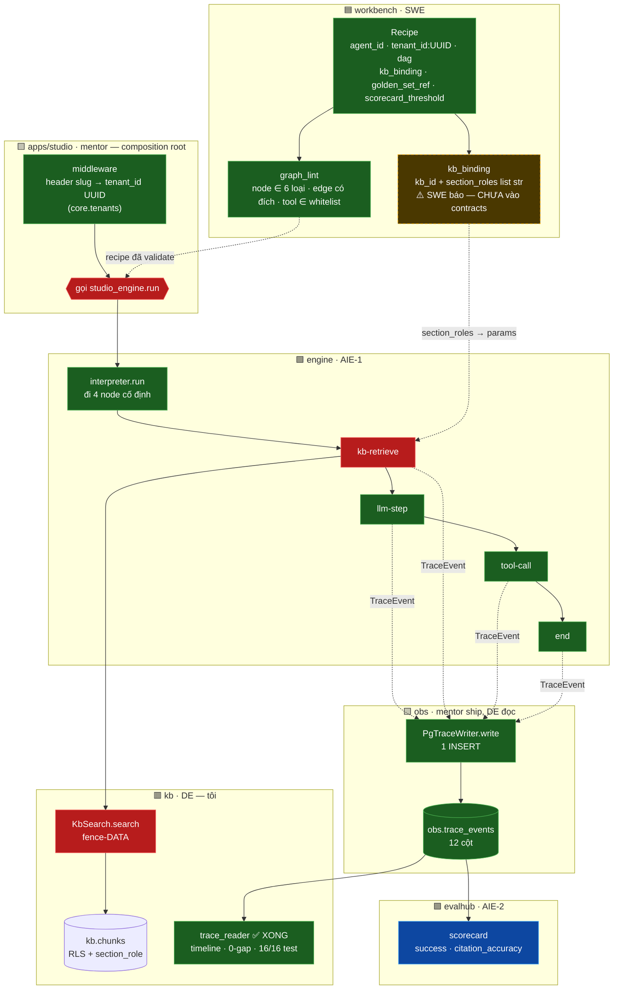
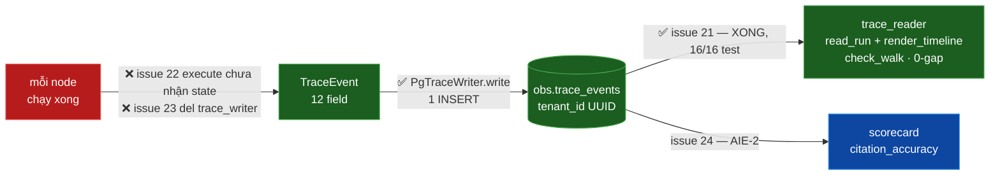

# LUỒNG CHẠY MỘT AGENT RUN

> **Mục đích:** một bản đồ duy nhất để biết *một câu hỏi của người dùng đi qua những đâu*, mỗi chặng
> **nhận gì / trả gì / để làm gì**, ai sở hữu, và **chỗ nào chưa nối**.
>
> Mọi ô trạng thái dưới đây đọc từ code thật ngày **24/07/2026**, không phải từ thiết kế. Chỗ nào là
> suy đoán đều ghi rõ.

---

## 1. Toàn cảnh — 4 quadrant + composition root



**Đọc màu:** 🟩 xanh = đã chạy được (gồm `trace_reader` — **xong hôm nay**) · 🟥 đỏ = **đứt** ·
🟨 vàng viền đứt = **SWE báo, chưa vào seam** · 🟪 tím = của người khác, chưa land.

---

## 2. Sáu loại node — tập đóng

`NodeType` (`studio_contracts/nodes.py`) là **nguồn sự thật duy nhất**, đóng ở 6 giá trị. Thêm loại
thứ 7 = breaking change, cần mini-RFC + 4/4 chữ ký. Cấm DSL Turing-complete.

| NodeType | Trong vòng đi hiện tại? | Thân executor |
|---|---|---|
| `kb-retrieve` | ✅ | ✅ đã điền |
| `llm-step` | ✅ | ✅ đã điền |
| `tool-call` | ✅ | ✅ đã điền (cần dispatcher) |
| `end` | ✅ | ✅ đã điền |
| `condition` | ❌ **không đi qua** | ❌ `NotImplementedError` |
| `hitl-pause` | ❌ **không đi qua** | ❌ `NotImplementedError` |

> ⚠️ **Vòng đi hôm nay là 4 node CỐ ĐỊNH, không đọc `edges`.**
> `_WALK_ORDER = (kb-retrieve, llm-step, tool-call, end)` — hardcode trong `interpreter.py`.
> Docstring nói rõ: đọc `recipe.dag.edges` để đi động là **Day 6 scope, cấm làm sớm**.
>
> **Điều này quyết định định nghĩa "0-gap" của reader tôi viết:** chuỗi kỳ vọng là **4 node**, không
> phải 6. So với 6 là báo thiếu oan hai node vốn không bao giờ chạy.

---

## 3. Từng node — nhận gì, trả gì, để làm gì

### 3.1 `kb-retrieve` — hàng rào tầng dữ liệu

| | |
|---|---|
| **Vai trò** | Lấy về **chỉ những chunk người hỏi được phép đọc**. Đây là fence-EXECUTOR (AIE-1) đứng trên fence-DATA (DE). |
| **Input** | `node.params`: `query` · `tenant` · `section_roles` · `top_k` |
| **Gọi ra** | `KbSearch.search(query, tenant_id: UUID, section_roles, top_k)` |
| **Output** | `list[KbSearchResultItem]` — mỗi item: `chunk_id · text · score · tenant_id:UUID · section_role` |
| **Chủ** | executor = AIE-1 · `KbSearch` impl = **DE** |

**Luật bất di:**
- `section_roles` phải **phân giải phía server**, truyền xuống **nguyên vẹn**. Nhận đè từ client = đúng lỗ T6 label-spoof mà hàng rào này sinh ra để chặn.
- **Cấm** lấy rộng rồi lọc sau bằng LLM. Umbrella-contract gọi thẳng đây là anti-pattern *"nhờ LLM đừng nói"* — hàng rào giả.
- Hàng rào có **hai trục**, chỉ một trục có lưới DB: RLS khoá `tenant_id`; `section_role` **không có policy nào**, chặn hoàn toàn bằng `WHERE`. Mất mệnh đề đó là hở, và hở **im lặng**.

> 🔴 **Hai chỗ lệch, đều đọc được từ code:**
> 1. `KbSearchService.search` vẫn `raise NotImplementedError` (`search.py:48`). Nơi duy nhất nối
>    `kb_search` vào interpreter là test wiring của SWE, truyền `EmptyKbSearch()` — **luôn trả `[]`**.
>    `PgKbSearch`/`StaticKbSearch` chỉ được dựng **trong test của kb**, chưa từng vào luồng.
> 2. Executor đọc `node.params.get("tenant")` — **tên cũ, kiểu cũ**. D-13 đã đổi thành
>    `tenant_id: UUID`. Đây là việc của AIE-1, **không phải của tôi** — chỉ báo.

---

### 3.2 `llm-step` — sinh câu trả lời + trích dẫn

| | |
|---|---|
| **Vai trò** | Gọi LLM trên prompt + ngữ cảnh, rồi **rút `chunk_id` ra thành citation**. |
| **Input** | `node.params` + `retrieved_chunks` — interpreter **tiêm sẵn** output của `kb-retrieve` vào |
| **Output** | `{"answer": str, "tokens": Tokens(0,0), "citations": [...], "refused": bool}` |
| **Chủ** | AIE-1 |

**Luật trích dẫn** (đã land, PR #5): một citation hợp lệ phải **vừa được truy xuất VỪA thực sự được
nhắc trong câu trả lời** dạng `[chunk_id]`. Trích "tất cả những gì lấy về" là **bug thật** — nó dẫn
nguồn mà LLM chưa từng dùng. Lỗi này bắt được khi chạy với `StaticKbSearch` của tôi (trả `top_k`
chunk, không phải 1).

> ⚠️ **`refused = not retrieved_chunks` — chỗ này hợp đồng của tôi đã chặn.**
> Suy "rỗng ⟺ phải từ chối" chỉ đúng với ca **bị fence chặn**. Sai với ca **trong phạm vi mà không có
> đáp án**: SC-04 trong `golden/smoke-5.yaml` — hàng rào loại sạch chunk Borea, vẫn còn 3 chunk
> `ankor` hợp lệ, truy xuất **không rỗng** mà agent **vẫn phải từ chối**.
> Xem `docs/contracts/kb-search.v0.md` §6.1a.

> `tokens` đang hardcode `Tokens(0, 0)` — LLM hiện là fixture replay, chưa đếm token thật. `embedding`
> nối vào constructor nhưng **chưa dùng**.

---

### 3.3 `tool-call` — chạy công cụ trong whitelist

| | |
|---|---|
| **Vai trò** | Gọi tool, **chỉ trong `agent_config.tool_whitelist`**. |
| **Input** | `node.params["tool"]` |
| **Output** | `{"tool": <name>, "status": "stub-dispatched"}` |
| **Chủ** | AIE-1 (runtime) · SWE (whitelist ở validator) |

Whitelist được gác **hai lớp**: validator của SWE là lớp chính, dispatcher ở đây là **thắt lưng thứ
hai**. Tool ngoài whitelist → dispatcher **raise**. Không có dispatcher → `NotImplementedError`.

---

### 3.4 `end` — nút kết thúc

| | |
|---|---|
| **Vai trò** | Đóng run, phát `TraceEvent` cuối, ráp kết quả trả về. |
| **Input** | — (bỏ qua `node`) |
| **Output** | `{"terminated": True}` |
| **Chủ** | AIE-1 |

Interpreter **dừng ngay sau `end`**, kể cả recipe còn node phía sau.

---

### 3.5 `condition` / `hitl-pause` — có trong hợp đồng, chưa vào luồng

| Node | Vai trò khi land | Trạng thái |
|---|---|---|
| `condition` | Rẽ nhánh theo `edges[].when` trên output node trước. SWE sở hữu ngữ pháp `when`, AIE-1 sở hữu việc tính nó lúc chạy | ❌ `NotImplementedError` |
| `hitl-pause` | **Dừng-chờ-người hạng nhất (INV-2)** — dừng run, phát pause-event, trả quyền cho playground chờ người duyệt rồi mới đi tiếp | ❌ `NotImplementedError` |

Hai node này **không nằm trong `_WALK_ORDER`**, nên chưa ảnh hưởng gì tới reader.

---

## 4. Đường trace — phần việc của tôi (#21) ✅ XONG



> **Đường READ đã thông từ `obs.trace_events` trở đi** (T → RD xanh): reader đọc, sắp, kiểm 0-gap
> đều chạy thật trên Postgres. Chỗ **duy nhất** còn đứt ở nhánh này là phía TRƯỚC bảng (N → E):
> chưa node nào ghi được event, vì `execute()` chưa nhận state (#22) và `del trace_writer` (#23).
> Reader của tôi là thứ **kiểm chứng** DoD *"mọi node emit event"* — sẵn sàng chờ event thật đổ vào.

**`TraceEvent` — 12 field** (`studio_contracts/trace.py`, bút DE):

| field | kiểu | ghi chú |
|---|---|---|
| `event_id` | `str` | PK |
| `run_id` | `str` | khoá gom một run |
| `agent_id` | `str` | |
| `tenant_id` | **`UUID`** | NOT NULL · INV-1 / **D-13** |
| `node_id` | `str` | |
| `node_type` | `NodeType` | |
| `ts` | `str` | ISO-8601, **cột là TEXT** |
| `inputs_hash` | `str` | |
| `outputs` | `dict` | jsonb |
| `tokens` | `Tokens` | jsonb |
| `cost` | `float` | numeric |
| `citations` | `list[str] \| None` | từ `kb-retrieve` |

**Hai cái bẫy cho reader — đã ghi vào plan D5:**

1. **`ts` là `TEXT`.** `ORDER BY ts` là **so chuỗi**, chỉ đúng khi mọi timestamp cùng định dạng và
   cùng độ dài. Lệch định dạng giữa các node = thứ tự sai **im lặng**. Phải parse ra `datetime` rồi
   mới sắp, và **raise khi parse hỏng**.
2. **Không assert `ts` tăng nghiêm ngặt.** Hai node cùng mili-giây có thể trùng `ts`. Dùng `ts` để
   **sắp**, dùng **tập node** để kiểm **0-gap**. Đừng trộn hai việc.

> `obs.trace_events` **không có RLS, không có policy** — khác hẳn `kb.chunks`. Nghiêng về **chủ ý**:
> trace là chức năng tin cậy của composition-root, không phải hành động của tenant. Reader đọc theo
> `run_id`, mà một run thuộc đúng một tenant → không lọt chéo **theo cấu trúc**. (Q-B, chờ xác nhận.)

---

## 5. Bảng đứt — cần gì để thông luồng

| # | Mắt xích | Trạng thái | Bằng chứng | Chủ |
|---|---|---|---|---|
| 1 | composition root gọi `studio_engine.run()` | 🔴 **không ai gọi** | grep toàn workspace: ngoài `packages/engine`, `studio_engine` chỉ xuất hiện trong docstring/comment/`.md` | mentor |
| 2 | interpreter → trace_writer | 🔴 **bị vứt** | `interpreter.py:82` `del trace_writer`; docstring: *"populating real TraceEvents is Day 5 scope"* | SWE **#23** |
| 3 | executor phát được event | 🔴 **không có đường** | `executors.py:32` `execute(self, node: Node)` — không nhận state/writer | AIE-1 **#22** |
| 4 | `RunResult.events` | 🔴 **luôn rỗng** | docstring `interpreter.py` nói thẳng | hệ quả của 2+3 |
| 5 | `kb-retrieve` → search thật | 🔴 **chỉ `EmptyKbSearch`** | `KbSearchService.search` = `NotImplementedError`; nơi nối duy nhất là `workbench/tests/test_wiring_d{3,4}.py` | **DE** |
| 6 | `llm-step` ← chunks | 🟢 **thông** | `interpreter.py` `model_copy(update={"params": {..., "retrieved_chunks": ...}})` — PR #5 | AIE-1 ✅ |
| 7 | `obs.trace_events` → reader | 🟢 **THÔNG — xong 24/07** | `trace_reader.py` — `pytest test_trace_reader.py` → **16/16 xanh** (10 thuần + 6 DB trên Postgres) | **DE #21 ✅** |
| 8 | evalhub → engine | 🔴 **chưa có adapter** | `.importlinter` **cấm** `studio_evalhub` import `studio_engine`; adapter là **#29** | AIE-2 |
| 9 | `kb` adopt D-13 (`tenant_id: UUID`) | 🟢 **XONG — 24/07 #25** | `pytest packages/kb/tests` → **48 passed, 2 xfailed** (Postgres thật, role `studio_owner`); mypy kb 0 lỗi; cột `UUID` + RLS `::uuid` | **DE #25 ✅** |
| 10 | `kb_binding` mang `section_roles` thay vì slug-trong-scope | 🟨 **SWE báo, chưa vào seam** | contracts@main + workbench@main (đã fetch 24/07) vẫn `KbBinding{kb_id, scope: str}`; không branch nào đổi. Là seam mentor-own (D-12) → cần PR + bump `SCHEMA_VERSION` | SWE + mentor duyệt |
| 11 | engine/workbench adopt D-13 | 🔴 **17 lỗi mypy** | `mypy packages apps` → engine 12 + workbench 4 + contracts 1: `EmptyKbSearch.search` còn `tenant: str`; `executors.py:85` truyền slug vào `search`; test thiếu `tenant_id` cho `Recipe`/`KbSearchResultItem` | AIE-1 (#22) + SWE |

**Đọc bảng này thế nào:** 11 mắt xích, **3 là của tôi** (#5, #7, #9) — **#7 và #9 nay đã xanh**, chỉ
còn **#5** (nối `PgKbSearch` thật vào interpreter, cần quyết định un-ratchet). Còn lại chỉ **báo,
không sửa** (domain khác). #10 dội vào tôi khi land (bump `SCHEMA_VERSION`). #11 là **hệ quả cùng
gốc D-13 với #9**: mình adopt xong ở kb, engine/workbench thì chưa — mypy toàn workspace phơi ra 17
lỗi ở đó. Đó là việc của AIE-1 (#22, `executors.py` đọc slug) và SWE, **mình chỉ báo**.

> **Hệ quả cho hôm nay:** reader (#21) **đã xong 100%** — chạy thật trên Postgres, 16/16 test. Nhưng
> **đọc trace của một run THẬT thì vẫn chưa**, vì #2+#3 làm bảng rỗng: chưa node nào ghi được event.
> DoD *"mọi node của 1 run emit event"* **không nằm trong tay tôi** — reader là thứ *kiểm chứng* nó,
> không phải thứ *gánh* nó. Nó đang **sẵn sàng chờ** event thật đổ vào.
>
> **Còn đứt để thông luồng end-to-end** (theo thứ tự dòng chảy): **#1** (ai gọi `run()`) → **#3** (#22,
> executor nhận state) → **#2** (#23, bỏ `del trace_writer`) cho nhánh trace; và **#5 + #9** (#25) cho
> nhánh kb-retrieve tìm được chunk thật. Trong số này **#5, #9 là của tôi**; #1/#2/#3 của mentor/SWE/
> AIE-1. Kể cả khi #10 (`kb_binding` mới) land, luồng **vẫn chưa thông** — nó chỉ sửa *danh tính
> tenant*, không nối mắt xích nào ở trên.

---

## 6. Các seam (hợp đồng) giữa 4 quadrant

`studio_contracts` là tầng đáy, ai cũng phụ thuộc. `.importlinter` bắt: **4 quadrant không import
lẫn nhau**, không import `studio_app`; chỉ `studio_app` được import mọi quadrant.

| Seam | Bút | Ai tiêu thụ |
|---|---|---|
| `Recipe` | SWE | engine (đi DAG) · evalhub (`golden_set_ref`, ngưỡng) |
| `KbSearch` + `KbSearchResultItem` | **DE** | engine (`kb-retrieve`) |
| `TraceEvent` + `TraceWriter` | **DE** | engine (phát) · app (ghi) · evalhub (chấm) |
| `Scorecard` | AIE-2 | workbench (hiện lên UI) |

**`SCHEMA_VERSION = "0.2.0-draft"`** — bump từ `0.1.0` theo **D-13** (`tenant` → `tenant_id: UUID`).
Đổi seam = mini-RFC + chữ ký (D-12); riêng D-13 mentor cho phép DEC+bump vì S1 chưa đóng.

### 🔴 Một recipe mang HAI danh tính tenant — mâu thuẫn với D-13

`KbBinding.scope` là **`str`** (vd `"ankor/public"`). `builder_d4.py` **tách chuỗi đó ra** để nạp
vào params của `kb-retrieve`:

```python
tenant_from_scope, roles_part = scope.split("/", 1)      # "ankor", "public"
section_roles = [r.strip() for r in roles_part.split(",") if r.strip()]

Node(type=NodeType.KB_RETRIEVE, params={
    "tenant": tenant_from_scope,     # ← SLUG
    "section_roles": section_roles, ...})

Recipe(tenant_id=t_id, ...)          # ← UUID, danh tính THẬT
```

| | giá trị | ai dùng |
|---|---|---|
| `recipe.tenant_id` | `UUID` | **không ai** — không gì luồn nó xuống node |
| `node.params["tenant"]` | `"ankor"` slug | **hàng rào `kb.search` dùng cái này** |

**Hàng rào đang key theo đúng thứ D-13 sinh ra để loại bỏ.** Lý do D-13 chọn UUID là *"slug/tên
**trùng được**"*; chỗ quyết định quyền đọc lại đang dùng slug.

Kèm theo: không ai kiểm `tenant_from_scope` có khớp `recipe.tenant_id`; `section_roles` tách bằng
`,` bên trong chuỗi phân cách bằng `/` → role chứa `/` hoặc `,` là hỏng **im lặng**.

> **Hệ quả cho #25:** khi `kb.chunks.tenant_id` lên UUID, `WHERE tenant_id = %s` nhận slug →
> `invalid input syntax for type uuid`. **Vỡ to tiếng, không rò rỉ im lặng** — nhưng nó **làm gãy
> `builder_d4.py` của SWE**. Báo SWE **trước** khi merge #25.
>
> ← đây là **vấn đề thật để nêu khi review PR SWE**, thay cho điểm `golden_set_ref` (đã hết đúng:
> SWE sửa thành `"callisto-smoke-5-v0"` rồi).

### 🟨 Bản sửa SWE đề xuất — `KbBinding{kb_id, section_roles: list[str]}` *(chưa land)*

SWE báo sẽ đổi `KbBinding` bỏ `scope: str`, thay bằng `kb_id` + `section_roles: list[str]` tường minh.
**Kiểm 24/07: chưa có trong `contracts@main` cũng như `workbench@main`** (đã fetch; không branch nào
đổi). Ghi lại đây vì nó *đúng hướng* và nếu land sẽ đổi bức tranh:

| | trước (hiện tại) | sau (SWE đề xuất) |
|---|---|---|
| `kb_binding` | `{kb_id, scope: "ankor/public"}` | `{kb_id, section_roles: ["public"]}` |
| tenant lấy từ đâu | slug tách khỏi `scope` | **chỉ** `recipe.tenant_id` (UUID) |
| `section_roles` | tách chuỗi bằng `,` trong `/` — hỏng im lặng | `list[str]` tường minh, không parse |

**Điều này sửa đúng lỗi "hai danh tính" ở trên:** slug biến mất khỏi `kb_binding`, tenant chỉ còn một
nguồn là `recipe.tenant_id` UUID. `section_roles` thành `list[str]` nên hết bẫy tách chuỗi.

> ⚠️ **Nhưng đây là seam mentor-own (D-12).** Đổi `KbBinding` = **bump `SCHEMA_VERSION`** (`0.2.0` →
> tiếp) + mini-RFC + mentor duyệt. Và bump đó **dội vào `kb`**: nếu code kb đọc `kb_binding` thì phải
> sửa theo. Hiện `kb` **không** đọc `kb_binding` trực tiếp (nó nhận `tenant`/`section_roles` qua
> `KbSearch.search`, do executor truyền), nên tác động lên tôi là **gián tiếp** — chỉ khi executor
> (#22, AIE-1) đổi cách lấy giá trị từ recipe. Không phải việc tôi làm, nhưng phải theo dõi.

---

## 7. Đường đi đầy đủ khi mọi thứ đã nối

```
người dùng hỏi
  └─> middleware: header slug ──(core.tenants)──> tenant_id UUID     [app]
       └─> recipe đã qua graph_lint                                   [workbench]
            └─> studio_engine.run(recipe, kb_search, llm, embedding, trace_writer)
                 │
                 ├─ kb-retrieve ─> KbSearch.search(query, tenant_id, section_roles, top_k)
                 │                  └─> kb.chunks  (RLS tenant + WHERE section_role)
                 │                       └─> list[KbSearchResultItem]  ──┐
                 │                                                        │
                 ├─ llm-step ──────── retrieved_chunks ◄─────────────────┘
                 │      └─> {answer, tokens, citations, refused}
                 │
                 ├─ tool-call ─> dispatch(tool ∈ whitelist)
                 │
                 └─ end ─> {terminated: True}
                      │
                      └─ mỗi node phát 1 TraceEvent ─> PgTraceWriter.write()
                                                         └─> obs.trace_events
                                                              ├─> trace_reader   (timeline, 0-gap)  [DE]
                                                              └─> scorecard      (citation_accuracy) [AIE-2]
```

---

*Sống cùng code — sửa file này khi một mắt xích ở §5 đổi trạng thái. Trạng thái ghi ở đây là của
**24/07/2026**, đọc trực tiếp từ source, không phải từ tài liệu thiết kế.*
