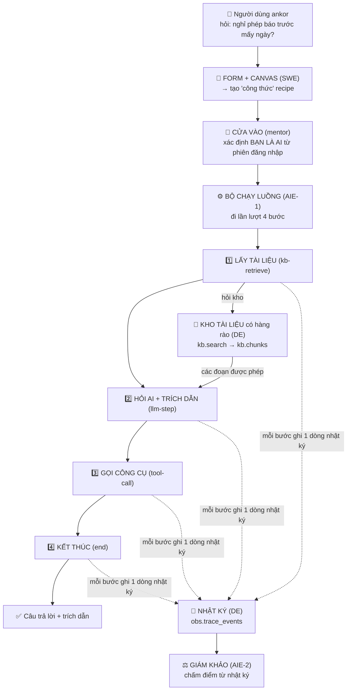

<!--
overview.md — bức tranh tổng thể dự án AgentCore Studio, viết cho người KHÔNG chuyên kỹ thuật.
Cập nhật MỖI NGÀY khi có code mới từ team (xem mục "Nhật ký cập nhật" ngay dưới).
Người giữ file: DE (DongAnh2704). Đặt ở repo kb theo yêu cầu.
Lưu ý: đây là văn bản do DongAnh2704 tự thiết kế và không có trong yêu cầu của mentor nhằm giúp nắm rõ flow hiện tại của dự án được cập nhật hằng ngày, owner của submodule khác không cần chú ý đến đây.
-->

# AgentCore Studio — Bức tranh tổng thể (đọc là hiểu, không cần biết code)

> **File này để làm gì?** Cho bạn thấy **toàn bộ dự án trong một chỗ**: nhóm đang xây cái gì, 4 người
> chia việc ra sao, một câu hỏi của người dùng **đi qua những đâu** (mỗi chặng *nhận gì → trả gì → dữ
> liệu lấy từ đâu*), và **mỗi ngày đã làm được gì**. Viết bằng lời thường + ví dụ, để một học sinh cấp
> 3 chưa học lập trình cũng đọc hiểu trọn vẹn.
>
> **Cập nhật:** file này được cập nhật **mỗi ngày** khi team có code mới. Ngày mới thêm ở mục 5.

## 🗓️ Nhật ký cập nhật file này
- **2026-08-05 (D13):** tạo file lần đầu — tổng hợp trọn 12 ngày (D1→D12) + trạng thái D13.
- **2026-08-06 (D14):** thêm D13→D14 vào nhật ký — kho pgvector thật (D13) + bộ câu mẫu "có răng" cho AIE-1 đo chất lượng tìm kiếm (D14).
- **2026-08-07 (D15):** chuyển "hôm nay" sang D15 — hoàn thiện màn hình xem nhật ký (thêm token + kiểm thứ tự đơn điệu); dọn mô tả trôi ở kho. **Không đổi cơ chế ghi nhật ký.**
- **2026-08-22:** bù D16→D23 (Sprint 2 khép + Sprint 3 mở) — vá hàng rào tại chỗ lấy dữ liệu thật D17, qua **GATE-2** D20, rồi đổi hẳn "kho" từ 140 đoạn đếm-từ sang **800 đoạn có vector nghĩa thật** (D21→D23). Cập nhật mục 4 (vector không còn là bag-of-words), mục 6 (trạng thái hôm nay), mục 7 (từ điển) theo code hiện tại. Nhân lúc này cũng ghi nhận 2 việc **vừa** merge bên `apps/studio` cùng ngày (GAP-1/GAP-2) — không phải việc của DE nhưng đụng đúng chỗ hàng rào đang treo.
- **2026-08-25:** bù D24→D27 (20→24/08) — **"cái còn thiếu" của D23 đã đóng**: câu hỏi người dùng giờ được vector-hoá bằng **model thật** (`gemini-embedding-001`, không còn bản ghi sẵn), 3 đường hỏi (chat/chạy thử/phát hành) đều đi qua đúng model đó. Kho tài liệu giờ **tự upload được thật** qua màn hình admin (trước đây chỉ là khung tĩnh) — cắt bằng cửa sổ trượt 850 từ/overlap 170 (chốt bằng đo A/B/C thật, không suy luận), nhận cả `.md`/`.txt`/`.docx` không cần cấu trúc heading. Vừa thêm cột `doc_id` thật (tách khỏi vai trò khoá chính của `chunk_id`) + khả năng xoá một tài liệu theo `doc_id`, đóng luôn lỗ "chunk mồ côi" khi re-upload bản ngắn hơn. Cập nhật mục 4 (thêm chặng "Kho tài liệu người dùng tự tải lên"), mục 5 (D24→D27), mục 6 (trạng thái hôm nay), mục 7 (từ điển). Ghi nhận thêm (không phải việc DE): AIE-1 đổi kiến trúc lõi bộ chạy luồng từ "đi lần lượt 4 bước cố định" sang **1 mô hình AI tự quyết định gọi công cụ nào, bao nhiêu lần** (vẫn giữ đường cũ làm phương án dự phòng); bộ câu mẫu chấm điểm (golden-set) chuyển từ file tĩnh sang lưu trong cơ sở dữ liệu, có hàng rào riêng theo khách hàng.

---

## 1. Dự án này là gì? (giải thích trong 1 phút)

Hãy tưởng tượng một **"xưởng làm trợ lý AI"** tên là **AgentCore Studio**.

Bình thường, muốn có một con trợ lý AI (chatbot trả lời dựa trên tài liệu công ty), người ta phải **thuê
lập trình viên code lại từ đầu** mỗi lần — chậm và dễ sai. Xưởng này thay đổi điều đó: người dùng chỉ cần
**điền một cái form + vẽ một sơ đồ**, là ra được một trợ lý — **không phải đụng vào code lõi**.

Ví như một **nhà bếp công nghiệp**: bếp, lò, dao (= *động cơ*, code lõi, xây một lần) là cố định; muốn
món khác thì đổi **công thức nấu** (= *recipe*, một tờ khai báo), không phải xây lại bếp.

**Ba nỗi đau mà xưởng phải chữa** (đây là lý do dự án tồn tại):

| Nỗi đau | Ví dụ đời thường | Cách xưởng chữa |
|---|---|---|
| **Rò rỉ dữ liệu chéo khách hàng** | Khách A hỏi, lại vô tình nhận được hồ sơ mật của khách B | **Hàng rào chặn ngay lúc lấy dữ liệu** (fence) |
| **Chất lượng tụt mà vẫn phát hành** | Ai đó chỉnh trợ lý cho tệ đi mà vẫn "lên sóng" được | **Cổng kiểm định** chặn phát hành khi điểm kém (eval-gate) |
| **Đổi hành vi phải sửa code** | Đổi một câu chỉ dẫn cũng phải gọi lập trình viên | Tách **động cơ** khỏi **công thức** — sửa công thức là xong |

**Đích ngắm cuối khoá** là một màn demo 8 bước chạy thật: *tạo agent bằng form → gắn công cụ + kho tài
liệu → vẽ luồng → bấm Test xem "nhật ký" → hỏi một câu chỉ có ở khách B trong khi đang là khách A →
**trợ lý phải từ chối, không bịa** → chạy 30 câu kiểm định → đạt thì cho phát hành → cố tình chỉnh cho
tệ → **cổng kiểm định chặn** → quay về bản cũ.*

> *Nguồn:* `docs/requirements/00-orientation/brief-overview.md` (đề bài gốc) và `pre-reading.md`.

---

## 2. Bốn người, bốn mảnh ghép

Dự án chia làm **4 mảng** ("quadrant"), mỗi bạn giữ trọn một mảng. Bốn mảnh cắm vào **cùng một luồng
chạy** thông qua **4 "hợp đồng"** (các bản thoả thuận về định dạng dữ liệu — xem mục 3).

| Người | Vai | Ví như trong nhà bếp | Giữ mảng nào (thư mục code) |
|---|---|---|---|
| **DE** — Nguyễn Đông Anh *(tôi)* | Data Engineer | **Thủ kho tài liệu + người quay camera nhật ký** | `packages/kb` (kho tri thức + fence) · dữ liệu quan trắc |
| **SWE** — Thiệu Quang Minh | Software Engineer | **Người thiết kế form + bản vẽ luồng** | `packages/workbench`, `apps/*` (form, canvas, "tường" chặn khách khai gian) |
| **AIE-1** — Trần Bá Đạt | AI Engineer 1 | **Đầu bếp chạy theo công thức** | `packages/engine` (bộ chạy luồng, gọi AI, trích dẫn) |
| **AIE-2** — Lưu Tiến Duy | AI Engineer 2 | **Giám khảo chấm món** | `packages/evalhub` (chấm điểm, cổng kiểm định) |

*Mentor* đóng vai "chủ xưởng": ráp các mảnh lại (composition root) và là người chấm.

> *Nguồn:* `pre-reading.md` §2 + các issue nhật ký trên GitHub (mỗi ngày 1 issue/người).

---

## 3. Bốn "hợp đồng" — ngôn ngữ chung để 4 mảnh ghép khớp nhau

Để 4 người làm việc độc lập mà vẫn ráp được, họ thống nhất trước **4 định dạng dữ liệu** (gọi là
"contract"). Ví như 4 người xây 4 mảnh của cây cầu ở 4 nơi khác nhau — phải thống nhất trước **kích
thước bù-lông** thì mới ghép được.

| Hợp đồng | Nói về cái gì | Ai giữ bút |
|---|---|---|
| **recipe** | "Công thức" một agent: chỉ dẫn + model + luồng 6 bước + phạm vi kho + ngưỡng đạt | SWE |
| **trace-event** | Một dòng "nhật ký": mỗi bước agent chạy ghi lại 1 sự kiện (thời gian, token, chi phí, trích dẫn) | DE |
| **kb.search** | Cách hỏi kho tài liệu: *"cho tôi các đoạn khớp câu này, chỉ trong phạm vi tôi được phép"* | DE |
| **scorecard** | "Bảng điểm": chấm mỗi câu Đạt/Không + độ chính xác trích dẫn | AIE-2 |

Bốn hợp đồng này được **"đóng băng" ở Ngày 11** — sau đó muốn đổi phải có đề xuất chính thức + cả 4
người ký. (Lý do: nếu ai cũng tự đổi định dạng thì mảnh của người khác vỡ mà không ai biết.)

> *Nguồn:* `packages/kb/docs/contracts/` + `docs/requirements/00-orientation/decisions-locked.md`.

---

## 4. Một câu hỏi đi qua những đâu? (luồng a→z, mỗi bước có INPUT / OUTPUT / nguồn)

Đây là phần cốt lõi bạn yêu cầu: **từng chặng nhận gì, trả gì, và dữ liệu đầu vào lấy từ đâu.**

Hãy theo một ví dụ chạy suốt: **Bạn là nhân viên khách hàng "ankor", hỏi: _"Xin nghỉ phép cần báo trước
mấy ngày?"_**

### Sơ đồ tổng (đọc từ trên xuống)

### Từng bước — Tên bước · Đầu vào · Đầu ra

Đọc quy ước: mỗi **đầu vào** ghi kèm *(lấy từ đâu)*; mỗi **đầu ra** ghi kèm *(chuyển đến bước nào)*.

**Bước A — Form → Công thức (SWE)**
- **Đầu vào:** thông tin agent = tên + chỉ dẫn + model + danh sách công cụ + phạm vi kho *(người dùng gõ vào form trên màn hình)*.
- **Đầu ra:** recipe / công thức *(chuyển đến Bước C; riêng phần "phạm vi kho" sẽ được dùng lại ở Bước 1)*.

**Bước B — Cửa vào / Tường chặn (mentor + SWE)**
- **Đầu vào:** mã phiên đăng nhập — session *(trình duyệt gửi khi người dùng đăng nhập)*.
- **Đầu ra:** danh tính thật = {khách hàng, người dùng, vai} *(server tự tra ra, KHÔNG lấy từ lời khách tự khai; chuyển đến Bước C và đặc biệt Bước 1)*.

**Bước C — Bộ chạy luồng (AIE-1)**
- **Đầu vào:** recipe đã kiểm hợp lệ *(từ Bước A)*; danh tính thật *(từ Bước B)*.
- **Đầu ra:** lệnh chạy lần lượt 4 bước 1→4 *(chuyển sang Bước 1)*.

**Bước 1 — Lấy tài liệu `kb-retrieve` (AIE-1 gọi, DE trả)**
- **Đầu vào:** câu hỏi *(người dùng nhập)*; khách hàng + vai *(từ Bước B — KHÔNG lấy từ câu hỏi)*; số đoạn tối đa + phạm vi kho *(từ recipe, Bước A)*.
- **Đầu ra:** danh sách đoạn tài liệu được phép đọc *(lấy từ kho `kb.search`/`kb.chunks` của DE; chuyển đến Bước 2)*; một dòng nhật ký *(chuyển đến Bước T)*.

**Bước 2 — Hỏi AI + trích dẫn `llm-step` (AIE-1)**
- **Đầu vào:** các đoạn tài liệu *(từ Bước 1, bộ chạy tự đưa vào)*; câu hỏi *(người dùng nhập)*.
- **Đầu ra:** câu trả lời kèm trích dẫn — mã đoạn đã dùng *(chuyển đến Bước 3, rồi ra kết quả cuối)*; một dòng nhật ký *(chuyển đến Bước T)*.

**Bước 3 — Gọi công cụ `tool-call` (AIE-1)**
- **Đầu vào:** tên công cụ cần gọi *(từ recipe — chỉ công cụ nằm trong "danh sách được phép")*.
- **Đầu ra:** kết quả công cụ *(chuyển đến Bước 4)*; một dòng nhật ký *(chuyển đến Bước T)*.

**Bước 4 — Kết thúc `end` (AIE-1)**
- **Đầu vào:** trạng thái gom lại *(từ các Bước 1–3)*.
- **Đầu ra:** kết quả cả run = câu trả lời + trích dẫn *(trả về người dùng)*; một dòng nhật ký *(chuyển đến Bước T)*.

**Bước T — Nhật ký `trace` (DE)**
- **Đầu vào:** một sự kiện cho mỗi bước — thời gian, token, chi phí, trích dẫn *(mỗi Bước 1–4 tự gửi)*.
- **Đầu ra:** các dòng nhật ký lưu vào bảng `obs.trace_events` *(chuyển đến Bước E)*.

**Bước E — Chấm điểm (AIE-2)**
- **Đầu vào:** nhật ký *(từ Bước T)*; đáp án chuẩn — golden-set *(bộ câu mẫu do DE gán nhãn tay)*.
- **Đầu ra:** bảng điểm = Đạt/Không + độ chính xác trích dẫn *(là kết quả cuối để quyết định cho phát hành hay không)*.

### Điều quan trọng nhất trong cả luồng: **HÀNG RÀO (fence)**

Ở **bước 1**, kho tài liệu **không trả mọi thứ rồi nhờ AI "đừng nói"**. Nó **lọc ngay tại chỗ lấy dữ
liệu**: chỉ đưa ra đoạn nào **đúng khách hàng + đúng vai** của người hỏi. Hai chốt an toàn:

- **Khách hàng (tenant):** khoá bằng luật của cơ sở dữ liệu (RLS) — như **thẻ ra-vào toà nhà**: không
  có thẻ đúng thì cửa không mở, dù bạn có nói gì.
- **Vai (section_role):** lọc bằng điều kiện truy vấn — như **phòng chỉ nhân sự mới vào được**.

Với ví dụ của ta: người hỏi là **ankor**, câu trả lời đúng nằm ở tài liệu **ankor** → trả về "báo trước
**3 ngày**", kèm trích dẫn `ankor-leave-001#c1`.

Nếu cùng người **ankor** đó hỏi *"hạn mức chi của khách borea là bao nhiêu?"* → hàng rào **loại sạch**
tài liệu borea → agent **từ chối**, không lộ con số của borea. Đó chính là chống **rò rỉ chéo khách hàng**.

> *Nguồn:* `packages/kb/flow.md` (bản đồ luồng của DE) + issue #59 (kết quả thông luồng a→z, 5/5 đạt).

### Luồng phụ: Tự tải tài liệu lên kho (mới, 24/08)

Trước đây kho chỉ nạp được bằng lệnh của DE chạy tay (ingest script). Giờ có thêm một **cửa nạp tài
liệu thật qua màn hình quản trị** — công ty tự tải file `.md`/`.txt`/`.docx` của mình lên, không cần
DE can thiệp.

- **Đầu vào:** 1 file + tên phòng ban được đọc *(người quản trị công ty chọn trên màn hình)*.
- **Xử lý:** cắt file thành nhiều đoạn bằng **cửa sổ trượt** (mỗi đoạn ~850 từ, đoạn sau lấn lại 170
  từ của đoạn trước để không đứt mạch ý) — khác cách cắt "theo tiêu đề chương mục" dùng cho kho mẫu có
  sẵn, vì tài liệu công ty tự soạn không chắc có tiêu đề chuẩn. Mỗi đoạn được gán một **mã tài liệu**
  (`doc_id`) rút từ tên file (vd `Bao Cao Q1.docx` → `bao-cao-q1`) — mã này **tách riêng khỏi** mã định
  danh nội bộ của từng đoạn (`chunk_id`, vẫn phải là duy nhất tuyệt đối trong toàn kho nên có thêm phần
  ngẫu nhiên phía sau, người dùng không nhìn thấy).
- **Đầu ra:** các đoạn mới, đã có vector, nằm trong đúng kho + đúng phòng ban của công ty đó. Tải lại
  file **cùng tên** (vd sửa nội dung rồi upload lại) sẽ **xoá sạch bản cũ trước khi ghi bản mới** —
  trước đây nếu bản mới có ít đoạn hơn bản cũ thì các đoạn dư sẽ "mồ côi" nằm lại trong kho mãi mãi,
  giờ đã đóng lỗ này.
- **Rủi ro đã biết, cố ý chưa chặn:** 2 file **khác tên gốc** nhưng rút gọn ra trùng mã tài liệu (rất
  hiếm) sẽ bị coi là cùng 1 tài liệu — file tải sau **âm thầm ghi đè** file trước. Chưa cần chặn cứng
  vì bảng mã tài liệu-tên gốc riêng nằm ngoài phạm vi hiện tại.

> *Nguồn:* `apps/studio/src/studio_app/routes/documents.py` + `packages/kb/src/studio_kb/chunk_window.py`.

---

## 5. Nhật ký từng ngày (D1→D14) — mỗi ngày team làm được gì (INPUT → OUTPUT)

Đọc theo tuần. Mỗi ô ghi: **mục tiêu ngày**, rồi **ai làm gì** (nhận đầu vào từ đâu → cho ra cái gì).

### 🟢 Tuần 1 (Sprint 1) — Dựng bộ khung mỏng chạy thông suốt

**Ngày 1 (20/07) — Khởi động.** Chưa viết code mới. Cả 4 dựng môi trường (Python 3.14), chạy thử bộ
test có sẵn (36 đạt), ký cam kết bảo mật, và **"teach-back"**: mỗi người giải thích lại mảng của mình.
*Input:* repo khung + đề bài. *Output:* mọi người hiểu ranh giới "động cơ vs công thức".
> DE trình bày 4 bước kho tài liệu: **ingest → chunk → embed → index**, mỗi bước một chỗ dễ hỏng.

**Ngày 2–3 (21–22/07) — Những mảnh stub đầu tiên.** Mỗi mảng dựng bản "giả tối thiểu" để ghép thử.
DE **viết bộ 5 tài liệu Callisto** (2 khách hàng ankor/borea) — *input:* đề bài + quy ước đặt tên;
*output:* 5 file tài liệu + 25 "đoạn" (chunk) có mã cố định.

**Ngày 4 (23/07) — Kho tài liệu tra được (bản thô).** DE viết `StaticKbSearch`: đọc thẳng 5 file, lọc
theo khách hàng + vai, trả về các đoạn khớp. *Input:* 5 tài liệu ngày 3. *Output:* `kb.search` v0 +
**5 câu mẫu có đáp án gán tay** (golden-set) để sau này chấm điểm.

**Ngày 5 (24/07) — Nhật ký vào cơ sở dữ liệu + Demo tuần #1.** Lần đầu **cả 4 mảnh chạy thông a→z**:
form → bộ chạy 4 bước → kho có fence → nhật ký lưu Postgres → chấm điểm. Kết quả **5/5 câu ĐẠT**.
*Input mỗi bước lấy từ mắt xích trước* (xem bảng mục 4). *Output:* bằng chứng "khung xương biết đi".

**Ngày 6 (27/07) — "Xâu kim" thật.** Thay các mối nối giả bằng **gọi thật** giữa 4 mảng: bộ chạy đọc
công thức thật (thay vì danh sách cứng), kho nhận lời gọi thật, nhật ký nhận sự kiện thật.

**Ngày 7 (28/07) — Chuẩn hoá "bộ tạo vector" + chạy 100% bằng bản ghi sẵn.** AIE-1 định nghĩa
**EmbeddingService** (bộ chuyển chữ → vector) dạng "1 giao diện, 2 bản" (bản giả cho test, bản thật để
sau). DE **cung cấp vector ghi sẵn** cho 25 đoạn (fixture) để test luôn ra kết quả giống nhau.
*Input:* 25 đoạn. *Output:* file vector cố định + test khoá tính lặp lại.

**Ngày 8 (29/07) — "Tường chặn khách khai gian" (INV-1).** SWE dựng lớp kiểm tra: **danh tính khách
hàng do server tự tra từ phiên đăng nhập, không tin lời client tự khai**. DE áp lọc theo khách hàng
**phía server** cho cả kho và nhật ký. *Vì sao quan trọng:* nếu tin lời khai, kẻ xấu chỉ cần "khai" mình
là khách khác là đọc trộm được.

**Ngày 9 (30/07) — Làm cứng + bằng chứng.** Mỗi mảng thêm test cho cả **ca đúng lẫn ca sai** (ví dụ:
hỏi chéo khách hàng thì phải bị chặn). DE kiểm nhật ký **đọc lại đúng thứ tự, không sót** và **dựng lại
được**.

**Ngày 10 (31/07) — GATE-1 (mốc nghiệm thu #1).** Demo "khung xương biết đi" chạy thật xuyên 4 mảng +
chứng minh **client khai gian bị bỏ qua** + **nhật ký đọc lại đúng thứ tự** + teach-back "vì sao hàng
rào và cổng kiểm định là LUẬT". *Đây là mốc cứng: qua được mới sang Sprint 2.*

### 🟡 Tuần 3 (Sprint 2) — Từ "khung xương" sang "cơ bắp thật"

**Ngày 11 (03/08) — Đóng băng 4 hợp đồng + tự viết design-note.** Cả 4 chốt cứng định dạng 4 hợp đồng
(recipe, trace-event, kb.search, scorecard) để không ai đổi bừa nữa. Mỗi người viết một ghi chú thiết kế
giải thích lựa chọn của mình. *Input:* kinh nghiệm Sprint 1. *Output:* 4 hợp đồng "FROZEN".

**Ngày 12 (04/08) — Phình kho tài liệu + bắt đầu canvas.** DE mở bộ tài liệu **từ 5 → 42 doc (25 → 140
đoạn)**, mỗi khách hàng đủ 4 vai, **chỉ thêm, không sửa 5 doc cũ** (để không làm hỏng các câu mẫu cũ).
SWE bắt đầu **canvas kéo-thả 6 loại node**. *Input:* đề bài Sprint 2 (cần 40–60 doc). *Output:* kho lớn
đủ để đo lường thật + bộ câu mẫu nháp 30 câu.

> **Vì sao phình kho?** 5 doc chỉ đủ demo; Sprint 2 cần đo "chất lượng tìm kiếm" và kiểm hàng rào ở
> quy mô thật nên cần nhiều tài liệu + đủ 4 vai cho mỗi khách hàng.

**Ngày 13 (05/08) — Kho tài liệu thành "kho thật".** DE biến kho từ **"đọc file tĩnh"** thành **kho
trong cơ sở dữ liệu** (Postgres + tìm theo độ tương đồng cosine), có hàng rào RLS per khách hàng. Bản
thật `PgKbSearch` ghép vào bộ chạy của AIE-1 **lần đầu**. *Input:* 140 đoạn ngày 12. *Output:* kho tra
được bằng cơ sở dữ liệu thật — **ankor 71 · borea 69 = 140**, lặp lại không nhân đôi.

**Ngày 14 (06/08) — Bộ câu mẫu "có răng" để đo chất lượng tìm kiếm.** DE cấp **20 câu hỏi kèm đáp án
chuẩn**: 14 câu "khó" (mỗi câu có ≥2 đoạn cạnh tranh cùng khách hàng+vai, để phân biệt được vector
tốt/xấu) + 6 câu **bẫy rò rỉ** (T1/T6). *Input:* kho 140 đoạn. *Output:* bộ câu mẫu cho AIE-1 đo trade-off
"cắt đoạn × vector" (DE cấp nhãn, không tự đo).

**Ngày 15 (07/08) — Màn hình xem nhật ký nhìn rõ hơn.** In thêm số token trên mỗi dòng nhật ký + báo rõ
nhật ký có phát đúng thứ tự thời gian không. Không đổi cách ghi nhật ký, chỉ đổi cách **xem lại**.

### 🟠 Tuần 4 (vẫn Sprint 2) — Khoá nốt hàng rào, chuẩn bị GATE-2

**Ngày 16 (10/08) — Bộ 30 câu mẫu thành "hàng đã đóng gói sẵn".** Thay vì gõ tay 30 câu vào một file rồi
dễ gõ sai, DE làm **một lệnh phát ra cả kho tài liệu lẫn bộ câu mẫu cùng lúc, từ cùng một nguồn** — như
vậy mã đoạn tài liệu trong câu mẫu **không bao giờ lệch** với mã đoạn thật trong kho. *Input:* kho 140
đoạn + 30 câu mẫu đã có từ ngày 14. *Output:* bộ 30 câu "tự dựng lại được", đổi tên chính thức thành bản
v1.

**Ngày 17 (11/08) — Vá lỗ hàng rào tại chỗ lấy dữ liệu.** Đây là ngày quan trọng nhất còn thiếu ở mục 4:
DE gỡ bỏ hẳn cánh cửa "chưa mở" (`KbSearchService` từng luôn báo lỗi) và **nối thẳng vào kho thật có hàng
rào**. Từ hôm nay, hỏi chéo khách hàng (**T1**) bị chặn **thật**, có bài kiểm tra xác nhận, không còn là
lời hứa. *Input:* kho thật (D13) + cơ chế lọc (D4). *Output:* cửa lấy tài liệu **luôn** lọc đúng khách
hàng trước khi trả kết quả — không còn đường nào lấy dữ liệu mà bỏ qua hàng rào này.

**Ngày 18 (12/08) — Đáp án "người chấm tự tay ghi".** DE gán 10 câu (trong 30 câu) một đáp án do **người
đọc tài liệu bằng mắt** ghi ra — dùng để kiểm xem "giám khảo AI" (AIE-2) chấm có giống người thật hay
không. Cùng ngày, cả nhóm chốt lại: bảng dữ liệu nào trong hệ thống **cần khoá hàng rào**, bảng nào không
cần (dựa vào bảng đó có chứa thông tin riêng-tư-theo-khách-hàng hay không, không dựa vào "đã xây xong
chưa").

**Ngày 19 (13/08) — Khép sổ trước gate + tự bắt lỗi của chính mình.** DE đóng nốt 3 việc còn treo (tính
tiền theo lượt chạy tính từ nhật ký, chốt hàng rào ở 2 bảng còn lại, chuẩn bị bằng chứng cho GATE-2) —
và phát hiện **chính mình** vừa phát biểu sai về "hệ thống đang ở đâu" vì quên lấy dữ liệu mới nhất từ
kho chung (chỉ lấy dữ liệu mới của module con, quên lấy của module cha). Tự sửa công khai trong ngày.

**Ngày 20 (14/08) — GATE-2 (mốc nghiệm thu #2).** Không viết tính năng mới — là ngày **trình bằng
chứng**: chạy thử hệ thống từ đầu (clone kho mới, làm theo đúng hướng dẫn) để xem người ngoài có dựng
được không — phát hiện hướng dẫn **thiếu một bước** (nạp tài liệu vào kho trước khi mở khoá) → vá ngay.
DE cũng tự chấm điểm mình theo phiếu chấm của thầy, thẳng thắn nhận phần làm chưa tốt (nộp phiếu muộn).
**Điểm tạm tính của DE: 91.91, sát ngưỡng cao nhất.** *Đây là mốc cứng: qua được mới sang Sprint 3.*

### 🔵 Sprint 3 — Từ "hàng rào chạy được" sang "kho hiểu nghĩa thật"

**Ngày 21 (17/08) — Bắt đầu lứa kho tài liệu thứ hai + "hầm chông" đo model.** Kho cũ (140 đoạn) chỉ đủ
để kiểm tra hàng rào có chạy hay không, không đủ để biết "máy tìm tài liệu" **giỏi hay dở**. DE dựng kho
mới **80 tài liệu / 800 đoạn**, siết luật đặt tên chặt hơn (thư mục = khách hàng, tên file = ai được đọc,
cấm khai gian), và bắt đầu xây một "bài thi" 100 câu hỏi gài bẫy để sau này so sánh các "bộ não tìm kiếm"
(embedding) khác nhau xem cái nào giỏi thật.

**Ngày 22 (18/08) — Tự vặn lại chính thước đo của mình.** DE phát hiện **3 chỗ đo sai** trong đúng bài thi
vừa dựng hôm qua: (1) một tên số liệu đặt sai nghĩa, (2) số "top 10 kết quả" không khớp với thực tế hệ
thống chỉ lấy 3, và (3) *lý do lớn nhất khiến máy tìm sai* hoá ra không phải do model kém mà do **kho tài
liệu cắt đoạn kém** — tên chương mục bị cắt bỏ khi chia nhỏ tài liệu, khiến máy "quên mất chủ đề" của
từng đoạn. Vá xong, tỉ lệ tìm đúng tăng rõ rệt mà không cần đổi model.

**Ngày 23 (19/08) — Đổi "kho đếm từ" thành "kho hiểu nghĩa" — dấu mốc lớn nhất Sprint 3 tới giờ.** Từ
Ngày 4 tới nay, kho luôn dùng cách hiểu văn bản **thô sơ**: đếm xem hai đoạn văn dùng chung bao nhiêu từ
(giống đếm chữ, không hiểu nghĩa). Hôm nay DE **đổi hẳn kho thật trong cơ sở dữ liệu** sang dùng **vector
do một model AI thật (`gemini-embedding-001`) sinh ra** — 2048 con số cho mỗi đoạn thay vì 8, đủ "chỗ"
để biểu diễn nghĩa câu chữ chứ không chỉ đếm từ trùng. Toàn bộ 800 đoạn của kho mới đã được nạp lại bằng
vector thật (không gọi máy chủ AI trực tiếp — dùng bản ghi sẵn do AIE-1 cung cấp, đã kiểm chứng khớp
từng số). *Việc còn thiếu để dùng được trong demo thật: khi người dùng gõ câu hỏi trực tiếp trên web,
câu hỏi đó cũng phải được đổi thành vector bằng ĐÚNG model đó — phần này là việc của AIE-1, DE mới xong
phần "nạp vào kho", chưa xong phần "hỏi kho".*

### 🟣 Sprint 3 (tiếp) — "Kho hiểu nghĩa" trở thành "kho dùng được thật"

**Ngày 24 (20/08) — Chốt chiều vector 2048 + vá migration không phá dữ liệu cũ.** Model thật sinh
vector 2048 con số (không phải 8 như bản giả trước đây). DE khoá cứng con số này trong cấu trúc kho,
và viết đường **nâng cấp kho cũ lên chiều mới mà không xoá mất dữ liệu văn bản** — chỉ tính lại phần
vector, giữ nguyên chữ.

**Ngày 25–26 (22/08) — Cửa hỏi kho được nối vào đúng model thật.** Đây chính là "việc còn thiếu" đã
ghi ở D23: câu hỏi người dùng gõ trên web giờ được đổi thành vector bằng **đúng** model đã dùng để nạp
kho (`gemini-embedding-001` qua cổng thật, không còn bản ghi sẵn) — 3 đường hỏi (chat/chạy thử/phát
hành) đều đi qua cùng một cửa. Cùng đợt, AIE-1 gửi vào kb 2 mảnh nền móng cho một kho tài liệu kiểu mới
(bảng "kho" + "tài liệu" + "con trỏ đoạn", tách khỏi bảng đoạn cũ) — DE chỉ nhận/xác nhận, chưa dùng.

**Ngày 27 (24/08) — Kho tự tải tài liệu lên (xem mục 4, luồng phụ) + chốt cách cắt đoạn bằng đo thật.**
Ba việc trong một đợt: (1) thử nghiệm A/B/C thật trên 100 câu hỏi để **chốt kích thước đoạn cắt** —
850 từ/chồng lấn 170 từ thắng cả bài đo chính lẫn bài đo "ngữ cảnh dài" (đoạn hẹp hơn tưởng chính xác
hơn nhưng thực ra làm nhiều đoạn na ná chen vào top kết quả); (2) dựng cửa cắt đoạn mới không đòi tài
liệu phải có tiêu đề chương mục, để nhận được cả `.txt` lẫn `.docx`; (3) mở màn hình admin **"Tải tài
liệu lên"** thật — công ty tự nạp kho, không cần DE chạy lệnh tay nữa.

---

## 6. Hôm nay đang ở đâu? (25/08 — Sprint 3, sau D27)

**Vừa xong (D24→D27, 20→24/08):** "cái còn thiếu" ghi ở D23 đã đóng — câu hỏi người dùng và nội dung
kho giờ đi qua **cùng một model vector thật** (`gemini-embedding-001`) ở cả 3 đường hỏi (chat/chạy
thử/phát hành), không còn khoảng lệch nào. Kho tài liệu giờ **tự tải lên được thật** qua màn hình admin
(mục 4, luồng phụ) — cắt bằng cửa sổ trượt 850/170 chốt bằng đo A/B/C thật (không suy luận), nhận cả
`.md`/`.txt`/`.docx`. Vừa thêm cột `doc_id` thật + khả năng xoá một tài liệu theo `doc_id`, đóng lỗ
"chunk mồ côi" khi công ty re-upload bản tài liệu ngắn hơn.

**Cái còn thiếu (không phải việc của DE):** cửa nạp tài liệu tự động mới dừng ở "nạp được" — chưa có
màn hình **xoá toàn bộ tài liệu của công ty** hay **nạp lại vector cho tất cả tài liệu cũ** dùng thật
(hai việc này đã có sẵn ở tầng máy — chỉ chưa có nút bấm nối tới). Bảng "kho tài liệu kiểu mới" AIE-1
gửi vào (22/08) cũng mới là khung, chưa ai dùng.

**Không phải việc DE nhưng đáng chú ý (20→24/08):** AIE-1 đổi kiến trúc lõi bộ chạy luồng — từ "đi lần
lượt 4 bước cố định" (mục 4) sang **1 mô hình AI tự quyết định gọi công cụ nào, bao nhiêu lần** (đường
cũ vẫn giữ làm phương án dự phòng), và bắt đầu cắm thêm công cụ thật ngoài "hỏi kho" (vd máy tính, xem
giờ). Bộ câu mẫu chấm điểm (golden-set) chuyển từ file tĩnh trên đĩa sang **lưu trong cơ sở dữ liệu**,
có hàng rào riêng theo khách hàng, và công ty giờ tự nạp bộ câu mẫu của mình được (trước đây chỉ DE gán
tay). Cách tính "chi phí một lượt chạy" cũng được nối vào **mọi** điểm ghi nhật ký, không còn rải rác.

**Vẫn treo từ trước (chưa đổi):** hàng rào-theo-vai (`section_role`) hiện vẫn *chỉ lọc bằng câu hỏi
SQL, chưa có khoá cơ sở dữ liệu riêng* như hàng rào-theo-khách-hàng (`tenant_id`) đã có — khoảng trống
đã biết trước, cố ý để dành, chưa phải lỗ hổng đang bị khai thác.

**Trạng thái phần chấm điểm Sprint 2 → GATE-2 (D20, 14/08):** đã qua, điểm tạm tính DE **91.91** — sát
ngưỡng cao nhất.

**Các ngày tới:** đo lại các "bộ não tìm kiếm" (embedding) khác nhau trên kho 800 đoạn với vector thật;
theo dõi quyết định còn treo về hàng rào-theo-vai ở tầng cơ sở dữ liệu; cân nhắc màn hình xoá/nạp-lại
kho một khi có nhu cầu thật, thay vì làm trước khi cần.

---

## 7. Từ điển bỏ túi (giải nghĩa mọi từ khó ở trên)

| Từ kỹ thuật | Nói nôm na |
|---|---|
| **agent / trợ lý AI** | Chatbot trả lời dựa trên tài liệu, theo một luồng định sẵn |
| **tenant (khách hàng)** | Một khách hàng/công ty có kho tài liệu riêng (ở đây: ankor, borea) |
| **chunk (đoạn)** | Một mẩu tài liệu đã cắt nhỏ, có mã riêng (vd `ankor-leave-001#c1`) |
| **embedding (vector)** | Biến một đoạn chữ thành dãy số, để máy so "gần nghĩa" bằng phép tính |
| **cosine** | Cách đo hai dãy số "gần nhau" cỡ nào (càng gần 1 càng giống) |
| **index / kb.chunks** | Kho tra cứu đã sắp sẵn để tìm nhanh |
| **fence / RLS (hàng rào)** | Luật chặn *tại chỗ lấy dữ liệu*: chỉ trả đoạn người hỏi được phép |
| **section_role (vai)** | Nhãn "ai được đọc" của một đoạn: public / hr / finance / engineering |
| **trace (nhật ký)** | Bản ghi từng bước agent chạy: thời gian, token, chi phí, trích dẫn |
| **citation (trích dẫn)** | Câu trả lời phải chỉ rõ *lấy từ đoạn nào* — chống bịa |
| **golden-set (câu mẫu)** | Bộ câu hỏi kèm đáp án chuẩn, gán nhãn tay, dùng để chấm điểm |
| **eval-gate (cổng kiểm định)** | Điểm dưới ngưỡng thì **chặn phát hành** |
| **recipe (công thức)** | Tờ khai báo một agent: chỉ dẫn + luồng + phạm vi kho — sửa cái này thay vì sửa code |
| **contract (hợp đồng)** | Định dạng dữ liệu 4 người thống nhất để ghép mảnh |
| **INV-1 / tenant-wall** | "Tường" xác định danh tính khách hàng ở server, bỏ qua lời client tự khai |
| **fixtures-first** | Test chạy 100% bằng dữ liệu ghi sẵn, không cần AI thật — để kết quả luôn lặp lại |
| **T1 / T6** | Hai kiểu tấn công rò rỉ: T1 = đọc chéo khách hàng; T6 = giả nhãn vai để đọc trộm |
| **Callisto 1.0 / 2.0** | Hai "lứa" kho tài liệu mẫu: 1.0 = 42 tài liệu/140 đoạn (S1-S2, kiểm hàng rào); 2.0 = 80 tài liệu/800 đoạn (S3, đo chất lượng tìm kiếm ở quy mô lớn hơn) |
| **hit@k** | "Trong k kết quả trả về đầu tiên, có đúng cái cần tìm không?" — 1 nếu có, 0 nếu không; k khớp đúng số đoạn mà hệ thống thật sự đưa cho AI đọc (hiện là 3) |
| **stratum S1–S5** | 5 "hạng" độ khó của câu hỏi kiểm tra: S1 trùng chữ (dễ) → S2 đổi cách nói (đồng nghĩa) → S3 có "mồi nhử" trông giống đáp án hơn cả đáp án thật → S4 mồi nhử ở phòng ban khác (kiểm hàng rào) → S5 hỏi thứ kho không có (phải biết từ chối) |
| **embed-view (`embed_text`)** | Chuỗi chữ *đem đi tính vector* có thể khác chuỗi chữ *lưu để hiển thị* — vd thêm lại tên chương mục đã bị cắt mất lúc chia đoạn, giúp máy "nhớ chủ đề" mà không đổi nội dung hiển thị |
| **GAP-1 / GAP-2** | Hai mục "khoảng trống đã biết trước, chưa vá" được đặt tên tắt để theo dõi: GAP-1 = khoá cơ sở dữ liệu cho bảng nhật ký; GAP-2 = bảng "ai thuộc phòng ban nào" — cả hai đều đã có bước đầu tiên merge 22/08, bên `apps/studio` |
| **doc_id** (mã tài liệu) | Nhãn thân thiện của MỘT tài liệu (rút từ tên file, vd `bao-cao-q1`) — nhiều đoạn (chunk) của cùng tài liệu chia sẻ chung 1 `doc_id`; dùng để xoá cả tài liệu một lần |
| **chunk_id** (mã đoạn) | Mã định danh DUY NHẤT của MỘT đoạn trong toàn kho (không riêng theo khách hàng) — khác `doc_id`, không được trùng dù 2 khách hàng cùng tên tài liệu |
| **cửa sổ trượt (sliding window)** | Cách cắt đoạn không cần tiêu đề chương mục: cắt theo SỐ TỪ cố định, đoạn sau lấn lại một phần đoạn trước để không đứt mạch ý — dùng cho tài liệu công ty tự tải lên |
| **agent-loop (1 mô hình AI tự quyết)** | Cách chạy mới của bộ chạy luồng (AIE-1, 20→24/08): thay vì đi lần lượt 4 bước cố định, để một model AI tự quyết định có cần gọi công cụ nào không, gọi mấy lần — đường 4-bước cũ vẫn giữ làm dự phòng |
| **golden_store** | Nơi lưu bộ câu mẫu (golden-set) — vừa chuyển từ file tĩnh trên đĩa sang bảng trong cơ sở dữ liệu, có hàng rào theo khách hàng, công ty tự nạp bộ của mình được |

---

## 8. Cách file này được cập nhật

**Tự động mỗi ngày:** khi sang ngày mới và đã **pull code mới nhất từ `main` của kit** (gồm các
submodule), người giữ file (DE) cập nhật **cả hai file** theo code mới:
1. Thêm một dòng vào **"Nhật ký cập nhật"** (đầu file).
2. Thêm ngày mới vào **mục 5** (hoặc cập nhật **mục 6 — hôm nay**).
3. Nếu có khái niệm mới, thêm vào **từ điển (mục 7)**.

> **Có hai bản, cập nhật song song:**
> - `overview.md` *(file này)* — bản **dễ hiểu cho người non-tech** (ẩn dụ + input/output từng bước).
> - `detail_overview.md` — bản **kỹ thuật đầy đủ** (tên file/class/hợp đồng thật, signature, cơ chế
>   fence, lệnh chạy). Đây là bản chi tiết nhất; file này là bản rút gọn của nó.
>
> Muốn sâu hơn nữa: luồng runtime xem `packages/kb/flow.md`; hợp đồng xem
> `packages/kb/docs/contracts/`; nhật ký từng ngày của DE xem `docs/reports/daily-notes/`.
