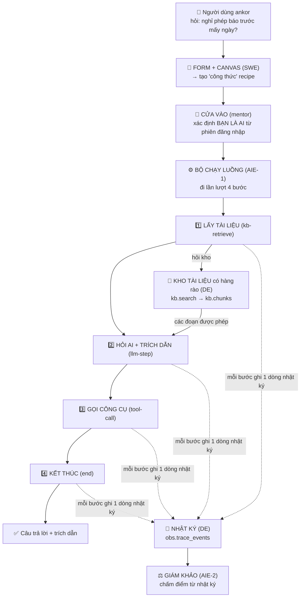

<!--
overview.md — bức tranh tổng thể dự án AgentCore Studio, viết cho người KHÔNG chuyên kỹ thuật.
Cập nhật MỖI NGÀY khi có code mới từ team (xem mục "Nhật ký cập nhật" ngay dưới).
Người giữ file: DE (DongAnh2704). Đặt ở repo kb theo yêu cầu.
Lưu ý: đây là văn bản do DongAnh2704 tự thiết kế và không có trong yêu cầu của mentor nhằm giúp nắm rõ flow hiện tại của dự án được cập nhật hằng ngày, owner của submodule khác không cần chú ý đến đây.
-->

# AgentCore Studio — Bức tranh tổng thể (đọc là hiểu, không cần biết code)

> **File này để làm gì?** Cho bạn thấy **toàn bộ dự án trong một chỗ**: nhóm đang xây cái gì, 4 người
> chia việc ra sao, một câu hỏi của người dùng **đi qua những đâu** (mỗi chặng *nhận gì → trả gì → dữ
> liệu lấy từ đâu*), và **mỗi ngày đã làm được gì**. Viết bằng lời thường + ví dụ, để một học sinh cấp
> 3 chưa học lập trình cũng đọc hiểu trọn vẹn.
>
> **Cập nhật:** file này được cập nhật **mỗi ngày** khi team có code mới. Ngày mới thêm ở mục 5.

## 🗓️ Nhật ký cập nhật file này
- **2026-08-05 (D13):** tạo file lần đầu — tổng hợp trọn 12 ngày (D1→D12) + trạng thái D13.

---

## 1. Dự án này là gì? (giải thích trong 1 phút)

Hãy tưởng tượng một **"xưởng làm trợ lý AI"** tên là **AgentCore Studio**.

Bình thường, muốn có một con trợ lý AI (chatbot trả lời dựa trên tài liệu công ty), người ta phải **thuê
lập trình viên code lại từ đầu** mỗi lần — chậm và dễ sai. Xưởng này thay đổi điều đó: người dùng chỉ cần
**điền một cái form + vẽ một sơ đồ**, là ra được một trợ lý — **không phải đụng vào code lõi**.

Ví như một **nhà bếp công nghiệp**: bếp, lò, dao (= *động cơ*, code lõi, xây một lần) là cố định; muốn
món khác thì đổi **công thức nấu** (= *recipe*, một tờ khai báo), không phải xây lại bếp.

**Ba nỗi đau mà xưởng phải chữa** (đây là lý do dự án tồn tại):

| Nỗi đau | Ví dụ đời thường | Cách xưởng chữa |
|---|---|---|
| **Rò rỉ dữ liệu chéo khách hàng** | Khách A hỏi, lại vô tình nhận được hồ sơ mật của khách B | **Hàng rào chặn ngay lúc lấy dữ liệu** (fence) |
| **Chất lượng tụt mà vẫn phát hành** | Ai đó chỉnh trợ lý cho tệ đi mà vẫn "lên sóng" được | **Cổng kiểm định** chặn phát hành khi điểm kém (eval-gate) |
| **Đổi hành vi phải sửa code** | Đổi một câu chỉ dẫn cũng phải gọi lập trình viên | Tách **động cơ** khỏi **công thức** — sửa công thức là xong |

**Đích ngắm cuối khoá** là một màn demo 8 bước chạy thật: *tạo agent bằng form → gắn công cụ + kho tài
liệu → vẽ luồng → bấm Test xem "nhật ký" → hỏi một câu chỉ có ở khách B trong khi đang là khách A →
**trợ lý phải từ chối, không bịa** → chạy 30 câu kiểm định → đạt thì cho phát hành → cố tình chỉnh cho
tệ → **cổng kiểm định chặn** → quay về bản cũ.*

> *Nguồn:* `docs/requirements/00-orientation/brief-overview.md` (đề bài gốc) và `pre-reading.md`.

---

## 2. Bốn người, bốn mảnh ghép

Dự án chia làm **4 mảng** ("quadrant"), mỗi bạn giữ trọn một mảng. Bốn mảnh cắm vào **cùng một luồng
chạy** thông qua **4 "hợp đồng"** (các bản thoả thuận về định dạng dữ liệu — xem mục 3).

| Người | Vai | Ví như trong nhà bếp | Giữ mảng nào (thư mục code) |
|---|---|---|---|
| **DE** — Nguyễn Đông Anh *(tôi)* | Data Engineer | **Thủ kho tài liệu + người quay camera nhật ký** | `packages/kb` (kho tri thức + fence) · dữ liệu quan trắc |
| **SWE** — Thiệu Quang Minh | Software Engineer | **Người thiết kế form + bản vẽ luồng** | `packages/workbench`, `apps/*` (form, canvas, "tường" chặn khách khai gian) |
| **AIE-1** — Trần Bá Đạt | AI Engineer 1 | **Đầu bếp chạy theo công thức** | `packages/engine` (bộ chạy luồng, gọi AI, trích dẫn) |
| **AIE-2** — Lưu Tiến Duy | AI Engineer 2 | **Giám khảo chấm món** | `packages/evalhub` (chấm điểm, cổng kiểm định) |

*Mentor* đóng vai "chủ xưởng": ráp các mảnh lại (composition root) và là người chấm.

> *Nguồn:* `pre-reading.md` §2 + các issue nhật ký trên GitHub (mỗi ngày 1 issue/người).

---

## 3. Bốn "hợp đồng" — ngôn ngữ chung để 4 mảnh ghép khớp nhau

Để 4 người làm việc độc lập mà vẫn ráp được, họ thống nhất trước **4 định dạng dữ liệu** (gọi là
"contract"). Ví như 4 người xây 4 mảnh của cây cầu ở 4 nơi khác nhau — phải thống nhất trước **kích
thước bù-lông** thì mới ghép được.

| Hợp đồng | Nói về cái gì | Ai giữ bút |
|---|---|---|
| **recipe** | "Công thức" một agent: chỉ dẫn + model + luồng 6 bước + phạm vi kho + ngưỡng đạt | SWE |
| **trace-event** | Một dòng "nhật ký": mỗi bước agent chạy ghi lại 1 sự kiện (thời gian, token, chi phí, trích dẫn) | DE |
| **kb.search** | Cách hỏi kho tài liệu: *"cho tôi các đoạn khớp câu này, chỉ trong phạm vi tôi được phép"* | DE |
| **scorecard** | "Bảng điểm": chấm mỗi câu Đạt/Không + độ chính xác trích dẫn | AIE-2 |

Bốn hợp đồng này được **"đóng băng" ở Ngày 11** — sau đó muốn đổi phải có đề xuất chính thức + cả 4
người ký. (Lý do: nếu ai cũng tự đổi định dạng thì mảnh của người khác vỡ mà không ai biết.)

> *Nguồn:* `packages/kb/docs/contracts/` + `docs/requirements/00-orientation/decisions-locked.md`.

---

## 4. Một câu hỏi đi qua những đâu? (luồng a→z, mỗi bước có INPUT / OUTPUT / nguồn)

Đây là phần cốt lõi bạn yêu cầu: **từng chặng nhận gì, trả gì, và dữ liệu đầu vào lấy từ đâu.**

Hãy theo một ví dụ chạy suốt: **Bạn là nhân viên khách hàng "ankor", hỏi: _"Xin nghỉ phép cần báo trước
mấy ngày?"_**

### Sơ đồ tổng (đọc từ trên xuống)

### Từng bước — Tên bước · Đầu vào · Đầu ra

Đọc quy ước: mỗi **đầu vào** ghi kèm *(lấy từ đâu)*; mỗi **đầu ra** ghi kèm *(chuyển đến bước nào)*.

**Bước A — Form → Công thức (SWE)**
- **Đầu vào:** thông tin agent = tên + chỉ dẫn + model + danh sách công cụ + phạm vi kho *(người dùng gõ vào form trên màn hình)*.
- **Đầu ra:** recipe / công thức *(chuyển đến Bước C; riêng phần "phạm vi kho" sẽ được dùng lại ở Bước 1)*.

**Bước B — Cửa vào / Tường chặn (mentor + SWE)**
- **Đầu vào:** mã phiên đăng nhập — session *(trình duyệt gửi khi người dùng đăng nhập)*.
- **Đầu ra:** danh tính thật = {khách hàng, người dùng, vai} *(server tự tra ra, KHÔNG lấy từ lời khách tự khai; chuyển đến Bước C và đặc biệt Bước 1)*.

**Bước C — Bộ chạy luồng (AIE-1)**
- **Đầu vào:** recipe đã kiểm hợp lệ *(từ Bước A)*; danh tính thật *(từ Bước B)*.
- **Đầu ra:** lệnh chạy lần lượt 4 bước 1→4 *(chuyển sang Bước 1)*.

**Bước 1 — Lấy tài liệu `kb-retrieve` (AIE-1 gọi, DE trả)**
- **Đầu vào:** câu hỏi *(người dùng nhập)*; khách hàng + vai *(từ Bước B — KHÔNG lấy từ câu hỏi)*; số đoạn tối đa + phạm vi kho *(từ recipe, Bước A)*.
- **Đầu ra:** danh sách đoạn tài liệu được phép đọc *(lấy từ kho `kb.search`/`kb.chunks` của DE; chuyển đến Bước 2)*; một dòng nhật ký *(chuyển đến Bước T)*.

**Bước 2 — Hỏi AI + trích dẫn `llm-step` (AIE-1)**
- **Đầu vào:** các đoạn tài liệu *(từ Bước 1, bộ chạy tự đưa vào)*; câu hỏi *(người dùng nhập)*.
- **Đầu ra:** câu trả lời kèm trích dẫn — mã đoạn đã dùng *(chuyển đến Bước 3, rồi ra kết quả cuối)*; một dòng nhật ký *(chuyển đến Bước T)*.

**Bước 3 — Gọi công cụ `tool-call` (AIE-1)**
- **Đầu vào:** tên công cụ cần gọi *(từ recipe — chỉ công cụ nằm trong "danh sách được phép")*.
- **Đầu ra:** kết quả công cụ *(chuyển đến Bước 4)*; một dòng nhật ký *(chuyển đến Bước T)*.

**Bước 4 — Kết thúc `end` (AIE-1)**
- **Đầu vào:** trạng thái gom lại *(từ các Bước 1–3)*.
- **Đầu ra:** kết quả cả run = câu trả lời + trích dẫn *(trả về người dùng)*; một dòng nhật ký *(chuyển đến Bước T)*.

**Bước T — Nhật ký `trace` (DE)**
- **Đầu vào:** một sự kiện cho mỗi bước — thời gian, token, chi phí, trích dẫn *(mỗi Bước 1–4 tự gửi)*.
- **Đầu ra:** các dòng nhật ký lưu vào bảng `obs.trace_events` *(chuyển đến Bước E)*.

**Bước E — Chấm điểm (AIE-2)**
- **Đầu vào:** nhật ký *(từ Bước T)*; đáp án chuẩn — golden-set *(bộ câu mẫu do DE gán nhãn tay)*.
- **Đầu ra:** bảng điểm = Đạt/Không + độ chính xác trích dẫn *(là kết quả cuối để quyết định cho phát hành hay không)*.

### Điều quan trọng nhất trong cả luồng: **HÀNG RÀO (fence)**

Ở **bước 1**, kho tài liệu **không trả mọi thứ rồi nhờ AI "đừng nói"**. Nó **lọc ngay tại chỗ lấy dữ
liệu**: chỉ đưa ra đoạn nào **đúng khách hàng + đúng vai** của người hỏi. Hai chốt an toàn:

- **Khách hàng (tenant):** khoá bằng luật của cơ sở dữ liệu (RLS) — như **thẻ ra-vào toà nhà**: không
  có thẻ đúng thì cửa không mở, dù bạn có nói gì.
- **Vai (section_role):** lọc bằng điều kiện truy vấn — như **phòng chỉ nhân sự mới vào được**.

Với ví dụ của ta: người hỏi là **ankor**, câu trả lời đúng nằm ở tài liệu **ankor** → trả về "báo trước
**3 ngày**", kèm trích dẫn `ankor-leave-001#c1`.

Nếu cùng người **ankor** đó hỏi *"hạn mức chi của khách borea là bao nhiêu?"* → hàng rào **loại sạch**
tài liệu borea → agent **từ chối**, không lộ con số của borea. Đó chính là chống **rò rỉ chéo khách hàng**.

> *Nguồn:* `packages/kb/flow.md` (bản đồ luồng của DE) + issue #59 (kết quả thông luồng a→z, 5/5 đạt).

---

## 5. Nhật ký 12 ngày — mỗi ngày team làm được gì (INPUT → OUTPUT)

Đọc theo tuần. Mỗi ô ghi: **mục tiêu ngày**, rồi **ai làm gì** (nhận đầu vào từ đâu → cho ra cái gì).

### 🟢 Tuần 1 (Sprint 1) — Dựng bộ khung mỏng chạy thông suốt

**Ngày 1 (20/07) — Khởi động.** Chưa viết code mới. Cả 4 dựng môi trường (Python 3.14), chạy thử bộ
test có sẵn (36 đạt), ký cam kết bảo mật, và **"teach-back"**: mỗi người giải thích lại mảng của mình.
*Input:* repo khung + đề bài. *Output:* mọi người hiểu ranh giới "động cơ vs công thức".
> DE trình bày 4 bước kho tài liệu: **ingest → chunk → embed → index**, mỗi bước một chỗ dễ hỏng.

**Ngày 2–3 (21–22/07) — Những mảnh stub đầu tiên.** Mỗi mảng dựng bản "giả tối thiểu" để ghép thử.
DE **viết bộ 5 tài liệu Callisto** (2 khách hàng ankor/borea) — *input:* đề bài + quy ước đặt tên;
*output:* 5 file tài liệu + 25 "đoạn" (chunk) có mã cố định.

**Ngày 4 (23/07) — Kho tài liệu tra được (bản thô).** DE viết `StaticKbSearch`: đọc thẳng 5 file, lọc
theo khách hàng + vai, trả về các đoạn khớp. *Input:* 5 tài liệu ngày 3. *Output:* `kb.search` v0 +
**5 câu mẫu có đáp án gán tay** (golden-set) để sau này chấm điểm.

**Ngày 5 (24/07) — Nhật ký vào cơ sở dữ liệu + Demo tuần #1.** Lần đầu **cả 4 mảnh chạy thông a→z**:
form → bộ chạy 4 bước → kho có fence → nhật ký lưu Postgres → chấm điểm. Kết quả **5/5 câu ĐẠT**.
*Input mỗi bước lấy từ mắt xích trước* (xem bảng mục 4). *Output:* bằng chứng "khung xương biết đi".

**Ngày 6 (27/07) — "Xâu kim" thật.** Thay các mối nối giả bằng **gọi thật** giữa 4 mảng: bộ chạy đọc
công thức thật (thay vì danh sách cứng), kho nhận lời gọi thật, nhật ký nhận sự kiện thật.

**Ngày 7 (28/07) — Chuẩn hoá "bộ tạo vector" + chạy 100% bằng bản ghi sẵn.** AIE-1 định nghĩa
**EmbeddingService** (bộ chuyển chữ → vector) dạng "1 giao diện, 2 bản" (bản giả cho test, bản thật để
sau). DE **cung cấp vector ghi sẵn** cho 25 đoạn (fixture) để test luôn ra kết quả giống nhau.
*Input:* 25 đoạn. *Output:* file vector cố định + test khoá tính lặp lại.

**Ngày 8 (29/07) — "Tường chặn khách khai gian" (INV-1).** SWE dựng lớp kiểm tra: **danh tính khách
hàng do server tự tra từ phiên đăng nhập, không tin lời client tự khai**. DE áp lọc theo khách hàng
**phía server** cho cả kho và nhật ký. *Vì sao quan trọng:* nếu tin lời khai, kẻ xấu chỉ cần "khai" mình
là khách khác là đọc trộm được.

**Ngày 9 (30/07) — Làm cứng + bằng chứng.** Mỗi mảng thêm test cho cả **ca đúng lẫn ca sai** (ví dụ:
hỏi chéo khách hàng thì phải bị chặn). DE kiểm nhật ký **đọc lại đúng thứ tự, không sót** và **dựng lại
được**.

**Ngày 10 (31/07) — GATE-1 (mốc nghiệm thu #1).** Demo "khung xương biết đi" chạy thật xuyên 4 mảng +
chứng minh **client khai gian bị bỏ qua** + **nhật ký đọc lại đúng thứ tự** + teach-back "vì sao hàng
rào và cổng kiểm định là LUẬT". *Đây là mốc cứng: qua được mới sang Sprint 2.*

### 🟡 Tuần 3 (Sprint 2) — Từ "khung xương" sang "cơ bắp thật"

**Ngày 11 (03/08) — Đóng băng 4 hợp đồng + tự viết design-note.** Cả 4 chốt cứng định dạng 4 hợp đồng
(recipe, trace-event, kb.search, scorecard) để không ai đổi bừa nữa. Mỗi người viết một ghi chú thiết kế
giải thích lựa chọn của mình. *Input:* kinh nghiệm Sprint 1. *Output:* 4 hợp đồng "FROZEN".

**Ngày 12 (04/08) — Phình kho tài liệu + bắt đầu canvas.** DE mở bộ tài liệu **từ 5 → 42 doc (25 → 140
đoạn)**, mỗi khách hàng đủ 4 vai, **chỉ thêm, không sửa 5 doc cũ** (để không làm hỏng các câu mẫu cũ).
SWE bắt đầu **canvas kéo-thả 6 loại node**. *Input:* đề bài Sprint 2 (cần 40–60 doc). *Output:* kho lớn
đủ để đo lường thật + bộ câu mẫu nháp 30 câu.

> **Vì sao phình kho?** 5 doc chỉ đủ demo; Sprint 2 cần đo "chất lượng tìm kiếm" và kiểm hàng rào ở
> quy mô thật nên cần nhiều tài liệu + đủ 4 vai cho mỗi khách hàng.

---

## 6. Hôm nay đang ở đâu? (D13 — 05/08)

**Việc DE hôm nay (#90):** biến kho tài liệu từ **"đọc file tĩnh"** thành **kho thật trong cơ sở dữ liệu**
(Postgres + tìm kiếm theo độ tương đồng), chạy per khách hàng.

- **Trước D13:** `kb.search` chạy bằng cách đọc thẳng file vào bộ nhớ (bản `StaticKbSearch`). Trả đúng
  trích dẫn, nhưng **chưa hề dùng cơ sở dữ liệu thật**.
- **D13 làm:** đổ 140 đoạn vào bảng `kb.chunks` (có hàng rào RLS), và `kb.search` bản thật xếp hạng bằng
  **độ tương đồng cosine**. Đã chạy: **khách ankor 71 đoạn · borea 69 đoạn = 140**, lặp lại không nhân đôi.
- **Bàn giao AIE-1:** cung cấp "cửa" `PgKbSearch` để bộ chạy của AIE-1 cắm vào (ghép thật DE×AIE-1 lần đầu).

**Điều cần biết cho người non-tech:** hiện "vector" vẫn tính bằng cách **đếm từ chung** (bag-of-words),
**chưa phải AI hiểu nghĩa thật**. Việc đổi sang vector-hiểu-nghĩa để **Sprint 3** và chỉ khi hạ tầng bảo
mật được cấp — đây là lựa chọn có chủ đích (chấm điểm là *quy trình + hàng rào*, không phải *độ thông
minh của AI*).

**Các ngày tới (D14→D20):** đo chất lượng tìm kiếm → làm "màn hình xem nhật ký" → bộ 30 câu kiểm định →
siết hàng rào chống rò rỉ (T1/T6) → giá tiền token → **GATE-2 (D20)** ghép tất cả chạy thật lần đầu.

---

## 7. Từ điển bỏ túi (giải nghĩa mọi từ khó ở trên)

| Từ kỹ thuật | Nói nôm na |
|---|---|
| **agent / trợ lý AI** | Chatbot trả lời dựa trên tài liệu, theo một luồng định sẵn |
| **tenant (khách hàng)** | Một khách hàng/công ty có kho tài liệu riêng (ở đây: ankor, borea) |
| **chunk (đoạn)** | Một mẩu tài liệu đã cắt nhỏ, có mã riêng (vd `ankor-leave-001#c1`) |
| **embedding (vector)** | Biến một đoạn chữ thành dãy số, để máy so "gần nghĩa" bằng phép tính |
| **cosine** | Cách đo hai dãy số "gần nhau" cỡ nào (càng gần 1 càng giống) |
| **index / kb.chunks** | Kho tra cứu đã sắp sẵn để tìm nhanh |
| **fence / RLS (hàng rào)** | Luật chặn *tại chỗ lấy dữ liệu*: chỉ trả đoạn người hỏi được phép |
| **section_role (vai)** | Nhãn "ai được đọc" của một đoạn: public / hr / finance / engineering |
| **trace (nhật ký)** | Bản ghi từng bước agent chạy: thời gian, token, chi phí, trích dẫn |
| **citation (trích dẫn)** | Câu trả lời phải chỉ rõ *lấy từ đoạn nào* — chống bịa |
| **golden-set (câu mẫu)** | Bộ câu hỏi kèm đáp án chuẩn, gán nhãn tay, dùng để chấm điểm |
| **eval-gate (cổng kiểm định)** | Điểm dưới ngưỡng thì **chặn phát hành** |
| **recipe (công thức)** | Tờ khai báo một agent: chỉ dẫn + luồng + phạm vi kho — sửa cái này thay vì sửa code |
| **contract (hợp đồng)** | Định dạng dữ liệu 4 người thống nhất để ghép mảnh |
| **INV-1 / tenant-wall** | "Tường" xác định danh tính khách hàng ở server, bỏ qua lời client tự khai |
| **fixtures-first** | Test chạy 100% bằng dữ liệu ghi sẵn, không cần AI thật — để kết quả luôn lặp lại |
| **T1 / T6** | Hai kiểu tấn công rò rỉ: T1 = đọc chéo khách hàng; T6 = giả nhãn vai để đọc trộm |

---

## 8. Cách file này được cập nhật

**Tự động mỗi ngày:** khi sang ngày mới và đã **pull code mới nhất từ `main` của kit** (gồm các
submodule), người giữ file (DE) cập nhật **cả hai file** theo code mới:
1. Thêm một dòng vào **"Nhật ký cập nhật"** (đầu file).
2. Thêm ngày mới vào **mục 5** (hoặc cập nhật **mục 6 — hôm nay**).
3. Nếu có khái niệm mới, thêm vào **từ điển (mục 7)**.

> **Có hai bản, cập nhật song song:**
> - `overview.md` *(file này)* — bản **dễ hiểu cho người non-tech** (ẩn dụ + input/output từng bước).
> - `detail_overview.md` — bản **kỹ thuật đầy đủ** (tên file/class/hợp đồng thật, signature, cơ chế
>   fence, lệnh chạy). Đây là bản chi tiết nhất; file này là bản rút gọn của nó.
>
> Muốn sâu hơn nữa: luồng runtime xem `packages/kb/flow.md`; hợp đồng xem
> `packages/kb/docs/contracts/`; nhật ký từng ngày của DE xem `docs/reports/daily-notes/`.
