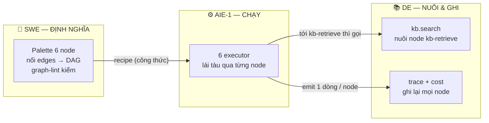
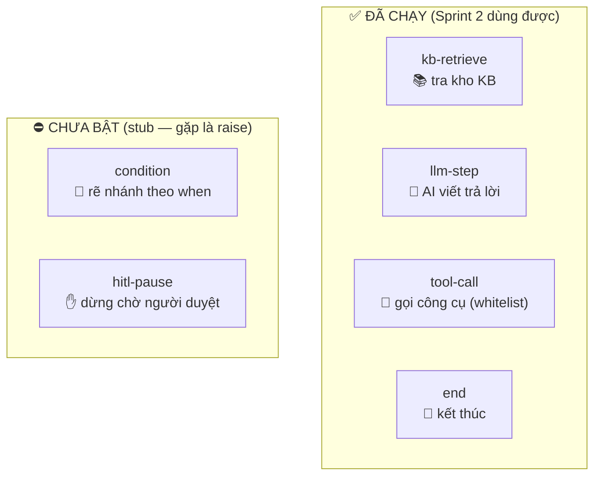
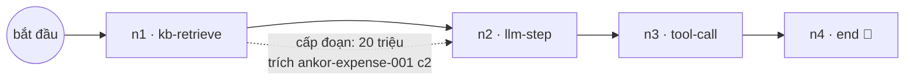
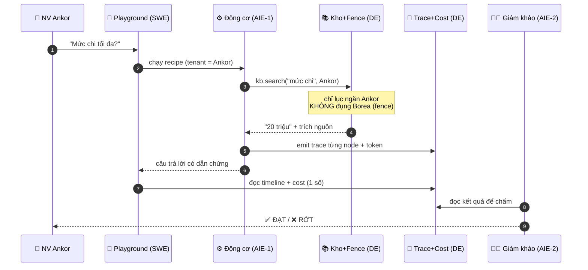
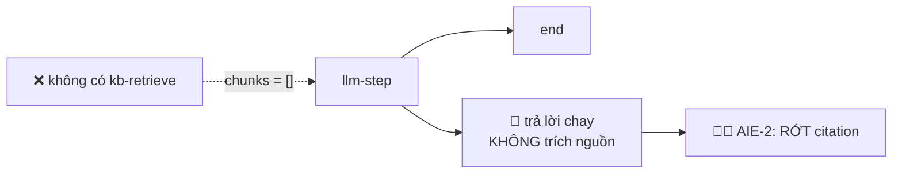
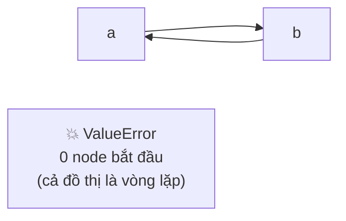
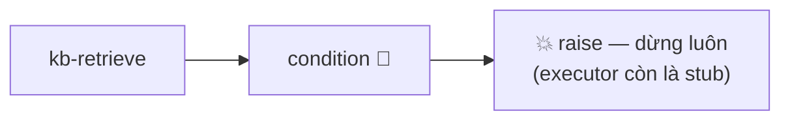
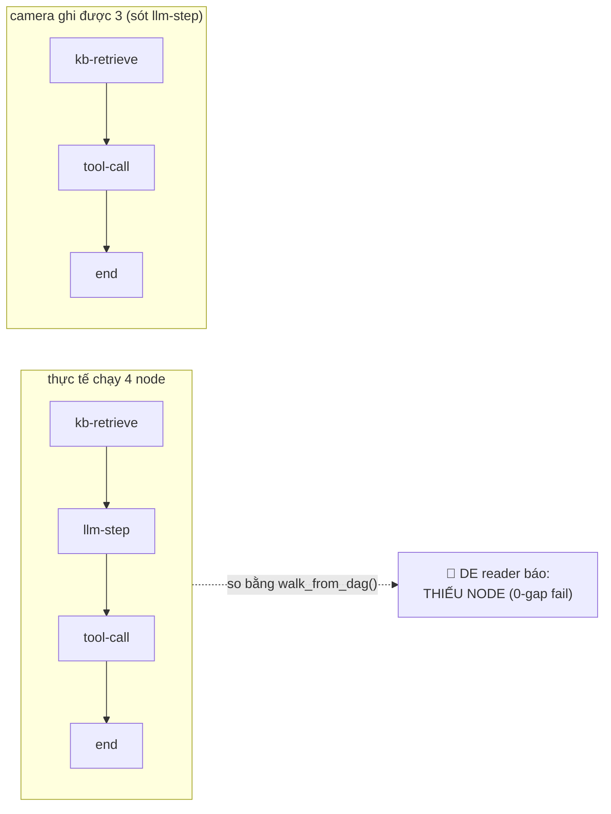
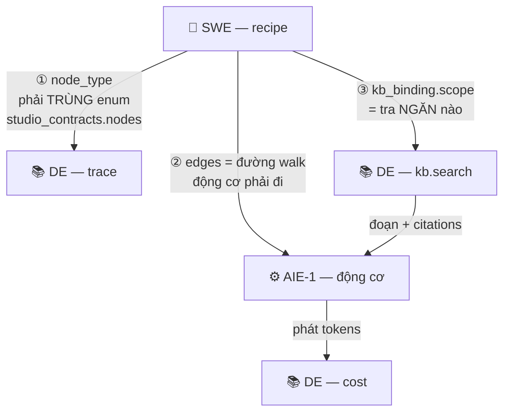
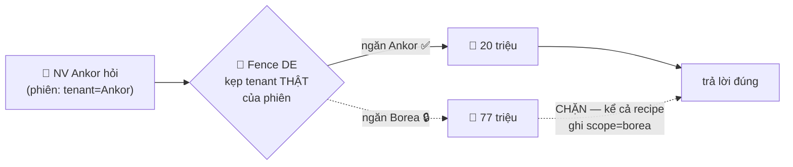

# 6 node hoạt động thế nào — minh hoạ bằng hình

> Đọc kèm `sprint2_overview.md`. Sơ đồ dưới viết bằng **Mermaid** → GitHub tự vẽ ra hình.
> Ví dụ xuyên suốt: nhân viên **Ankor** hỏi *"Mức chi tối đa?"* (Ankor = 20 triệu · Borea = 77 triệu).
> Nguồn: `studio_contracts/nodes.py`, `recipe.py`, `studio_engine/interpreter.py`, `studio_kb/trace_reader.py`.

---

## 1. Ai làm gì với node? (SWE định nghĩa → AIE-1 chạy → DE nuôi & ghi)

**Ví như bản đồ tàu điện:** SWE **vẽ bản đồ** (ga nào, ray nối ra sao). AIE-1 **lái tàu**. DE **bán vé cho ga kb-retrieve** và **ghi hành trình** (camera).

---

## 2. Sáu loại node — 4 cái đã bật, 2 cái chưa

> `condition` và `hitl-pause` còn là **stub** — động cơ gặp là **dừng, ném lỗi**. AIE-1 bật đủ 6 vào D14 (#96).

---

## 3. Một luồng chạy thật (walk) — recipe của trợ lý Ankor

Động cơ đi theo **mũi tên** từ node-bắt-đầu (không mũi tên trỏ vào) tới `end`: **n1 → n2 → n3 → n4**.
**Mỗi node chạy = 1 dòng trace** (camera DE ghi).

---

## 4. Một câu hỏi đi qua 4 vai

**DE xuất hiện 2 lần (KB, Trace) + cấp bộ đề cho AIE-2 chấm.**

---

## 5. Thiếu node thì gãy ở đâu? (3 kiểu)

### a) Thiếu `kb-retrieve` → AI trả lời chay, mất trích dẫn

### b) Nối edges sai / thiếu `end` → động cơ NÉM LỖI, không chạy

> Các lỗi tương tự: **>1 node bắt đầu** (không biết bắt đầu đâu) · **thòng lọng a→b→b** (thăm lại node cũ) · edge trỏ tới node không tồn tại. → recipe **không được interpret**.

### c) Dùng node CHƯA bật (`condition`/`hitl-pause`)

### d) (Của DE) Node chạy nhưng trace bị SÓT

> Nguy hiểm vì timeline **trông** liền mạch — mất bằng chứng mà không ai biết. DE suy chuỗi kỳ vọng **từ chính recipe.dag** rồi đối chiếu.

---

## 6. Ba "sợi dây" node của SWE tác động DE & AIE-1

| Dây | SWE đặt gì | Ảnh hưởng | Nếu sai |
|---|---|---|---|
| **①** | tên `node_type` | DE ghi trace theo enum này | SWE `kb_retrieve` ≠ DE `kb-retrieve` → camera lệch, báo sai |
| **②** | edges (nối node) | AIE-1 đi theo đúng đường | vòng lặp/hở đích → động cơ ném lỗi |
| **③** | `kb_binding.scope` | DE lục ngăn tương ứng | ghi nhầm `borea` → DE trả 77 triệu cho NV Ankor = **rò!** |

---

## 7. Vì sao fence của DE KHÔNG tin `scope` mù quáng

> **Bài học:** dù SWE lỡ cấu hình `scope` sai, hay client tự khai gian nhãn (T6), fence của DE vẫn kẹp theo **tenant thật của phiên do server quyết** → fail-closed, không rò. Đó là lý do D17 (#110) là ngày DE "áp mandatory filter tại retrieval".

---

## Tóm một hình
**SWE vẽ bản đồ (node + edges) → AIE-1 lái tàu qua từng node → DE bán vé cho ga `kb-retrieve` và quay camera mọi ga.** Thiếu ga hoặc vẽ sai ray: hoặc tàu không chạy (ValueError), hoặc chạy mà mất dẫn chứng / rò dữ liệu — và bảng điểm AIE-2 lãnh đủ.
